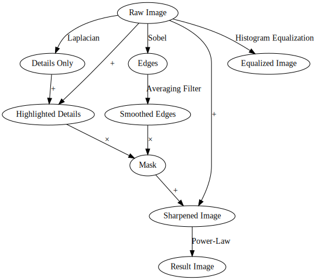
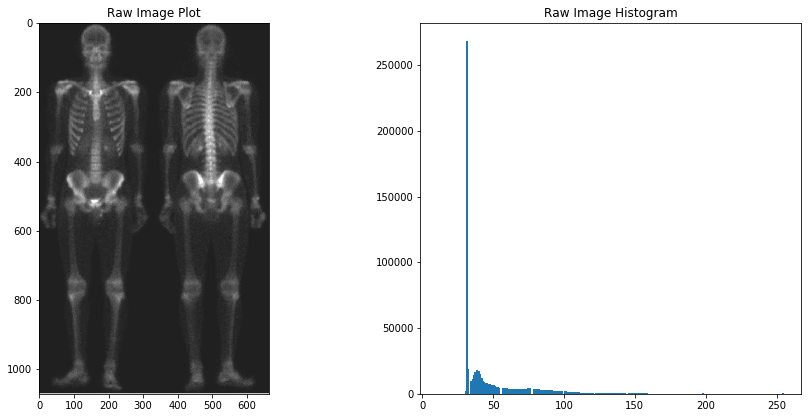
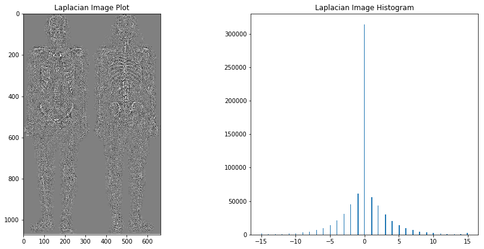
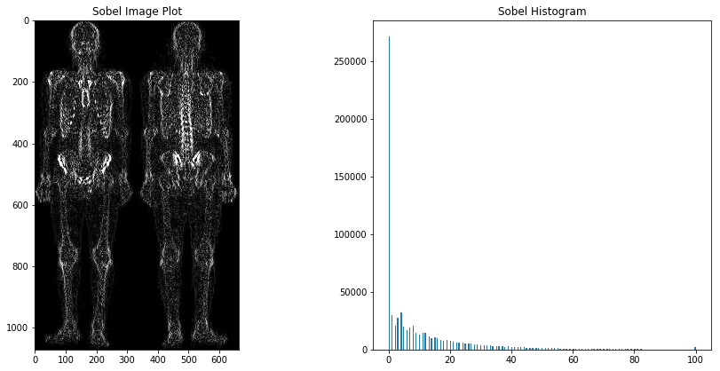
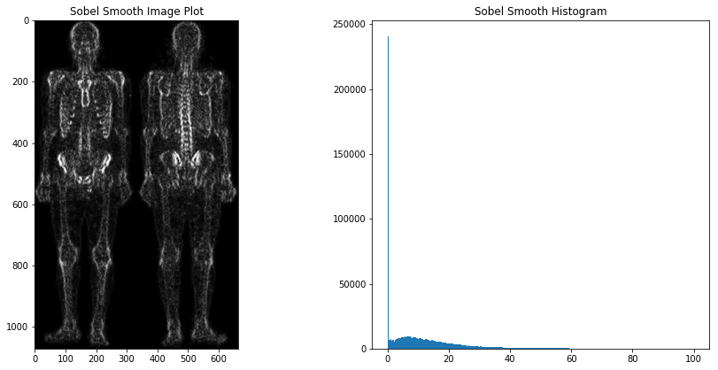
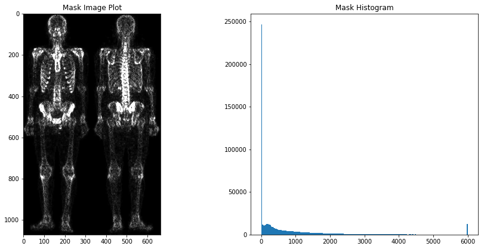
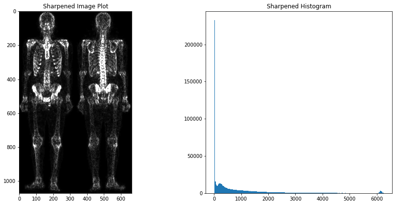
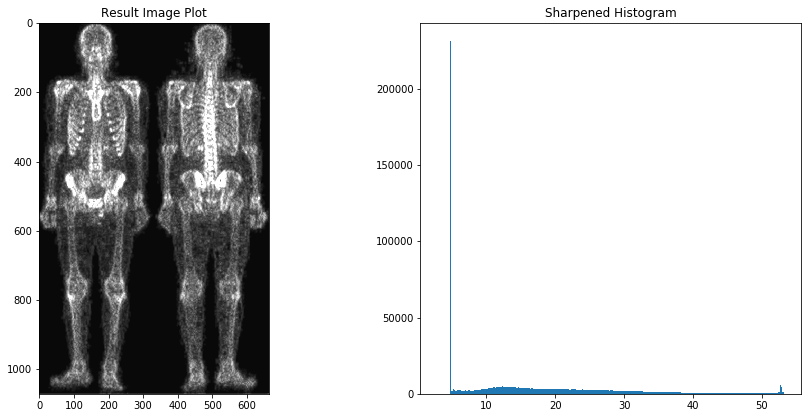
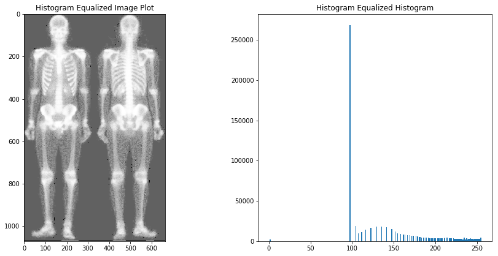

# Project 3

### Matt Giallourakis


```python
# Imports

from PIL import Image
import numpy as np
from IPython.display import display
import matplotlib.pyplot as plt
from graphviz import Digraph
from scipy.ndimage.filters import laplace
from scipy.ndimage import sobel
from scipy.ndimage import uniform_filter

%matplotlib inline
```

# Start with the original skeleton image and follow all the steps in that section to enhance the image and reach the final result after intensity transformation.

## Block diagram or a flow chart that describes the strategy


```python
# Block Diagram

graph = Digraph()

graph.edge('Raw Image', 'Details Only', 'Laplacian')
graph.edge('Raw Image', 'Highlighted Details', '+')
graph.edge('Details Only', 'Highlighted Details', '+')
graph.edge('Raw Image', 'Edges', 'Sobel')
graph.edge('Edges', 'Smoothed Edges', 'Averaging Filter')
graph.edge('Highlighted Details', 'Mask', '×')
graph.edge('Smoothed Edges', 'Mask', '×')
graph.edge('Raw Image', 'Sharpened Image', '+')
graph.edge('Mask', 'Sharpened Image', '+')
graph.edge('Sharpened Image', 'Result Image', 'Power-Law')
graph.edge('Raw Image', 'Equalized Image', 'Histogram Equalization')

graph
```





## a) Image of whole body bone scan


```python
raw_image = Image.open("skeleton_raw.jpg").convert('L')
raw_array = np.array(raw_image).astype(float)

# Show Image and Histogram

fig = plt.figure(figsize=(15, 15))

ax = fig.add_subplot(2, 2, 1)
ax.set_title('Raw Image Plot')
plt.imshow(raw_image)

ax = fig.add_subplot(2, 2, 2)
ax.set_title('Raw Image Histogram')
hist_plot = plt.hist(raw_array.flatten(), bins=255)

# Show Stats
print('Min:', min(raw_array.flatten()))
print('Max:', max(raw_array.flatten()))
print('Mean:', np.mean(raw_array.flatten()))
print('Std:', np.std(raw_array.flatten()))
print('Median:', np.median(raw_array.flatten()))
```

    Min: 11.0
    Max: 255.0
    Mean: 51.48463236376122
    Std: 29.709254960949725
    Median: 38.0
    





## b) Laplacian of (a)

The Lapliacian is a second-derivative operator that captures changes in gradients of an image. It has the advantage of enhancing wanted detail, but has the disadvantage of enhancing unwanted noise.

Mathematically, it is calculated using
$$ L(x,y) = \frac{\partial^2 I}{\partial x^2} + \frac{\partial^2 I}{\partial y^2}$$

But for the purposes of this code, the laplace function from scipy is used. The laplacian is then negated to match the result in the original procedure, and clipped to remove outliers.


```python
# Apply Transformation
laplacian_array = np.zeros(raw_array.shape, dtype=float)
laplace(raw_array, output=laplacian_array)

# This filter returns the negative of the process shown in the book
# Removed outliers by clipping values
laplacian_array = np.clip(-laplacian_array, -15, 15) 

# Show Image and Histogram

fig = plt.figure(figsize=(15, 15))

ax = fig.add_subplot(2, 2, 1)
ax.set_title('Laplacian Image Plot')
plt.imshow(laplacian_array, cmap='gray')

ax = fig.add_subplot(2, 2, 2)
ax.set_title('Laplacian Image Histogram')
hist_plot = plt.hist(laplacian_array.flatten(), bins=255)

# Show Stats
print('Min:', min(laplacian_array.flatten()))
print('Max:', max(laplacian_array.flatten()))
print('Mean:', np.mean(laplacian_array.flatten()))
print('Std:', np.std(laplacian_array.flatten()))
print('Median:', np.median(laplacian_array.flatten()))
```

    Min: -15.0
    Max: 15.0
    Mean: 0.012545810004975158
    Std: 3.1548043060258797
    Median: 0.0
    





## c) Sharpened image obtained by adding (a) and (b)

The Laplacian, which is all of the detail of an image, is added back onto the original image, so it highlights the details while still retaining the the low frequency detail of the image.


```python
# Apply Transformation
highlighted_detail_array = raw_array + laplacian_array

# Show Image and Histogram

fig = plt.figure(figsize=(15, 15))

ax = fig.add_subplot(2, 2, 1)
ax.set_title('Highlighted Detail Image Plot')
plt.imshow(highlighted_detail_array, cmap='gray')

ax = fig.add_subplot(2, 2, 2)
ax.set_title('Highlighted Detail Histogram')
hist_plot = plt.hist(highlighted_detail_array.flatten(), bins=255)

# Show Stats
print('Min:', min(highlighted_detail_array.flatten()))
print('Max:', max(highlighted_detail_array.flatten()))
print('Mean:', np.mean(highlighted_detail_array.flatten()))
print('Std:', np.std(highlighted_detail_array.flatten()))
print('Median:', np.median(highlighted_detail_array.flatten()))
```

    Min: -4.0
    Max: 270.0
    Mean: 51.497178173766194
    Std: 30.46439973138539
    Median: 38.0
    


## d) Sobel gradient of (a)

The Sobel operator is a first derivative operator that captures the gradient of an image. It has the advantage of highlighting edges of an image, but has the disadvantage of increasing noise as well. It is also more sensitive to left, right, up, and down gradients than diagonal gradients, which may impart patterns in an image that weren't originally there.

Mathematically, it is calculated using
$$ L(x,y) = \frac{\partial I}{\partial x} + \frac{\partial I}{\partial y}$$

But for the purposes of this code, the sobel function from scipy is used.
The absolute value of the sobel function is then taken, as the magnitude of the gradient is the desired output. The result is then clipped to remove outliers.


```python
# Apply Transformation
sobel_array = np.zeros(raw_array.shape, dtype=float)
sobel(raw_array, output=sobel_array, mode='nearest')

# To match the process used in the book
# Removed outliers by clipping values
sobel_array = np.clip(abs(sobel_array), 0, 100)

# Show Image and Histogram
fig = plt.figure(figsize=(15, 15))

ax = fig.add_subplot(2, 2, 1)
ax.set_title('Sobel Image Plot')
plt.imshow(sobel_array, cmap='gray')

ax = fig.add_subplot(2, 2, 2)
ax.set_title('Sobel Histogram')
hist_plot = plt.hist(sobel_array.flatten(), bins=255)

# Show Stats
print('Min:', min(sobel_array.flatten()))
print('Max:', max(sobel_array.flatten()))
print('Mean:', np.mean(sobel_array.flatten()))
print('Std:', np.std(sobel_array.flatten()))
print('Median:', np.median(sobel_array.flatten()))
```

    Min: 0.0
    Max: 100.0
    Mean: 10.395613451148842
    Std: 15.916070849866147
    Median: 4.0
    





## e) Sobel image smoothed with a 5x5 averaging filter

The sobel image from the previous step is then smoothed using a 5x5 uniform filter.
This replaces each pixel with the uniform average of itself and its neighbors in a 5x5 area (the kernel).
If a pixel of the kernel is outside of the original image, the nearest pixel inside the image is used instead.


```python
# Apply Transformation
sobel_smooth_array = np.zeros(raw_array.shape, dtype=float)
uniform_filter(sobel_array, output=sobel_smooth_array, mode='nearest', size=5)

# Show Image and Histogram
fig = plt.figure(figsize=(15, 15))

ax = fig.add_subplot(2, 2, 1)
ax.set_title('Sobel Smooth Image Plot')
plt.imshow(sobel_smooth_array, cmap='gray')

ax = fig.add_subplot(2, 2, 2)
ax.set_title('Sobel Smooth Histogram')
hist_plot = plt.hist(sobel_smooth_array.flatten(), bins=255)

# Show Stats
print('Min:', min(sobel_smooth_array.flatten()))
print('Max:', max(sobel_smooth_array.flatten()))
print('Mean:', np.mean(sobel_smooth_array.flatten()))
print('Std:', np.std(sobel_smooth_array.flatten()))
print('Median:', np.median(sobel_smooth_array.flatten()))
```

    Min: -1.0036416142611415e-13
    Max: 100.00000000000007
    Mean: 10.395518712905284
    Std: 13.347108738259896
    Median: 6.280000000000014
    





## f) Mask image formed by the product of (c) and (e)

The product of c (highlighted detail) and e (smoothed edges) acts as an "and" operation of sorts, preserving the intensities if they are in both images. This step is likely to remove the unwanted noise amplified by steps b and d.


```python
# Apply Transformation
mask_array = highlighted_detail_array*sobel_smooth_array

# Removed outliers
mask_array = np.clip(mask_array, 0, 6000)

# Show Image and Histogram
fig = plt.figure(figsize=(15, 15))

ax = fig.add_subplot(2, 2, 1)
ax.set_title('Mask Image Plot')
plt.imshow(mask_array, cmap='gray')

ax = fig.add_subplot(2, 2, 2)
ax.set_title('Mask Histogram')
hist_plot = plt.hist(mask_array.flatten(), bins=255)

# Show Stats
print('Min:', min(mask_array.flatten()))
print('Max:', max(mask_array.flatten()))
print('Mean:', np.mean(mask_array.flatten()))
print('Std:', np.std(mask_array.flatten()))
print('Median:', np.median(mask_array.flatten()))
```

    Min: 0.0
    Max: 6000.0
    Mean: 754.8474958131584
    Std: 1213.7025068671403
    Median: 245.67999999999975
    





## g) Sharpened image obtained by the sum of (a) and (f)

The wanted detail from f is added back onto the original image, making an image where the low-detail data is preserved, high-detail data is highlighted without also highlighting noise. 


```python
# Apply Transformation
sharpened_array = raw_array + mask_array

# Show Image and Histogram
fig = plt.figure(figsize=(15, 15))

ax = fig.add_subplot(2, 2, 1)
ax.set_title('Sharpened Image Plot')
plt.imshow(sharpened_array, cmap='gray')

ax = fig.add_subplot(2, 2, 2)
ax.set_title('Sharpened Histogram')
hist_plot = plt.hist(sharpened_array.flatten(), bins=255)

# Show Stats
print('Min:', min(sharpened_array.flatten()))
print('Max:', max(sharpened_array.flatten()))
print('Mean:', np.mean(sharpened_array.flatten()))
print('Std:', np.std(sharpened_array.flatten()))
print('Median:', np.median(sharpened_array.flatten()))
```

    Min: 11.0
    Max: 6255.0
    Mean: 806.3321281769195
    Std: 1238.6209095158708
    Median: 284.6
    





## h) Final result obtained by applying a power-law transformation to (g)

A gamma factor is applied to our image to increase the contrast of the image.


```python
# Apply Transformation
gamma = 2.2
result_array = sharpened_array**(1/gamma)

# Show Image and Histogram
fig = plt.figure(figsize=(15, 15))

ax = fig.add_subplot(2, 2, 1)
ax.set_title('Result Image Plot')
plt.imshow(result_array, cmap='gray')

ax = fig.add_subplot(2, 2, 2)
ax.set_title('Sharpened Histogram')
hist_plot = plt.hist(result_array.flatten(), bins=255)

# Show Stats
print('Min:', min(result_array.flatten()))
print('Max:', max(result_array.flatten()))
print('Mean:', np.mean(result_array.flatten()))
print('Std:', np.std(result_array.flatten()))
print('Median:', np.median(result_array.flatten()))
```

    Min: 2.974132490750926
    Max: 53.15668264022601
    Mean: 16.147681266080603
    Std: 12.143659556579268
    Median: 13.048521823408535
    





# Histogram Matching


```python
levels = np.histogram(raw_array.flatten(), bins=256, range=(0, 256))[0]
levels_norm = levels/sum(levels)

total = 0
hist_map = {}
for i in range(256):
    total+=levels_norm[i]
    hist_map[i] = round(total*255)

@np.vectorize
def apply_histogram(r):
    return hist_map[r]

hist_eq_array = apply_histogram(raw_array)
fig = plt.figure(figsize=(15, 15))

ax = fig.add_subplot(2, 2, 1)
ax.set_title('Histogram Equalized Image Plot')
plt.imshow(hist_eq_array, cmap='gray')

ax = fig.add_subplot(2, 2, 2)
ax.set_title('Histogram Equalized Histogram')
hist_plot = plt.hist(hist_eq_array.flatten(), bins=255)

# Show Stats
print('Min:', min(hist_eq_array.flatten()))
print('Max:', max(hist_eq_array.flatten()))
print('Mean:', np.mean(hist_eq_array.flatten()))
print('Std:', np.std(hist_eq_array.flatten()))
print('Median:', np.median(hist_eq_array.flatten()))
```

    Min: 0.0
    Max: 255.0
    Mean: 146.5598301438592
    Std: 53.10395641870979
    Median: 129.0
    





# Conclusion

The result of the original approach shows much more detail and less noise than the histogram equalization method. This may be due to the background heavily skewing the histogram equalization. There were some outliers that were removed as well caused by the various filters on the noise.
