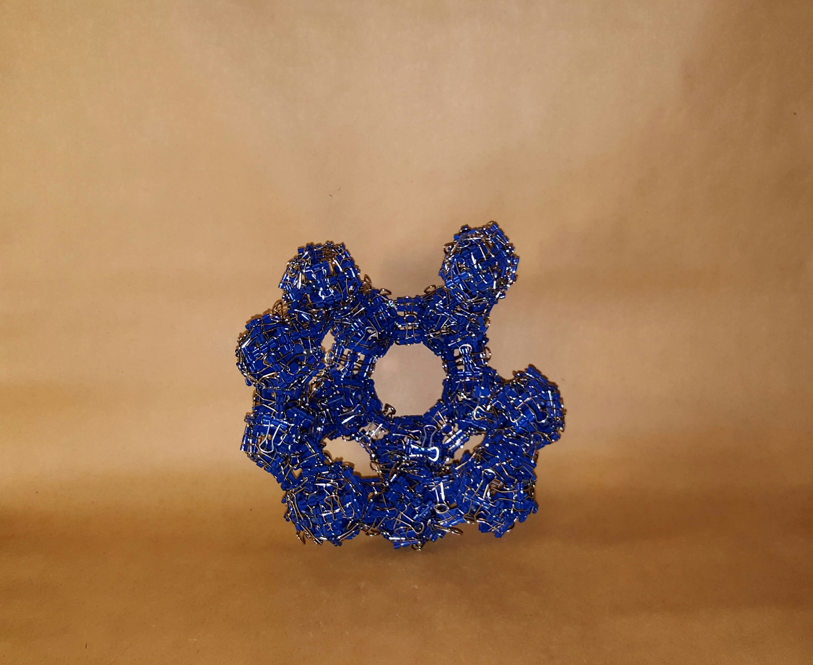

# Binder Clip Sculptures

I took some of the principles I learned from modular origami and applied them to linking together binder clips. I find binder clip sculptures more forgiving than origami sculptures since the units are more rigid, but they cost more to make and rely on a limited resource (I often bought all of this specific product in many counties. You can find some of the ones I've done [here](https://drive.google.com/open?id=1uABK2NUtKT1iUfCFFVFfhH9nnlzSPueE).

**Some of my favorites:**

### *Dark Energy*

### *Pendelica Metal*

### *The Cobalt Nebula*

