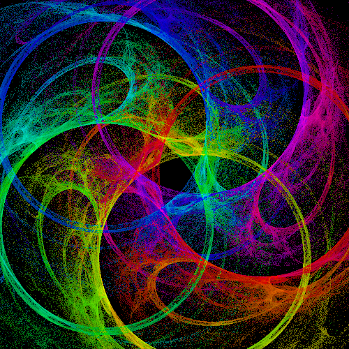
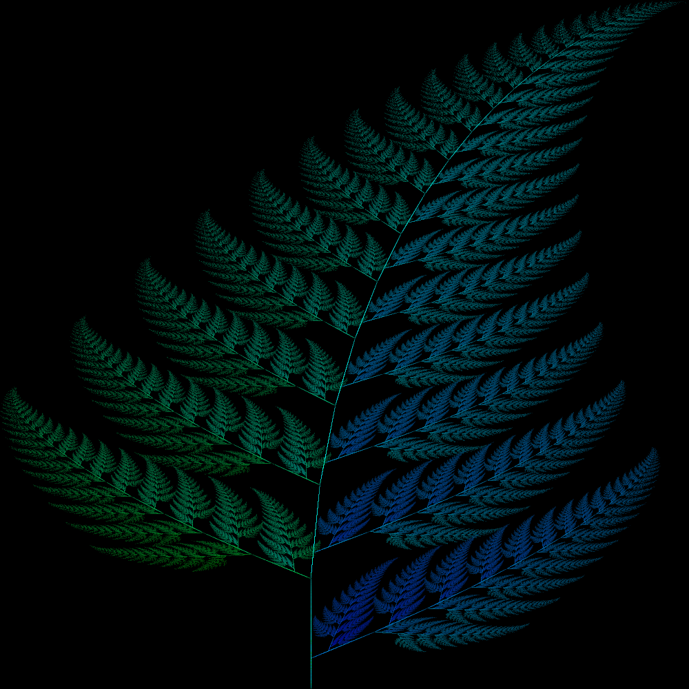
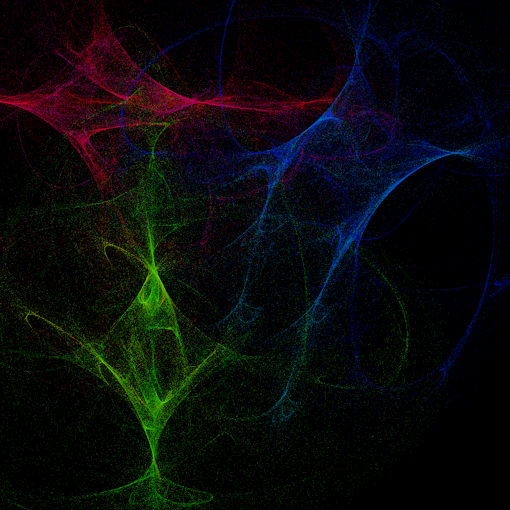
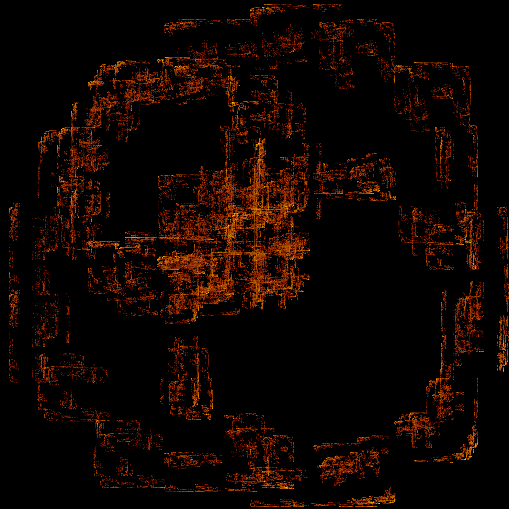
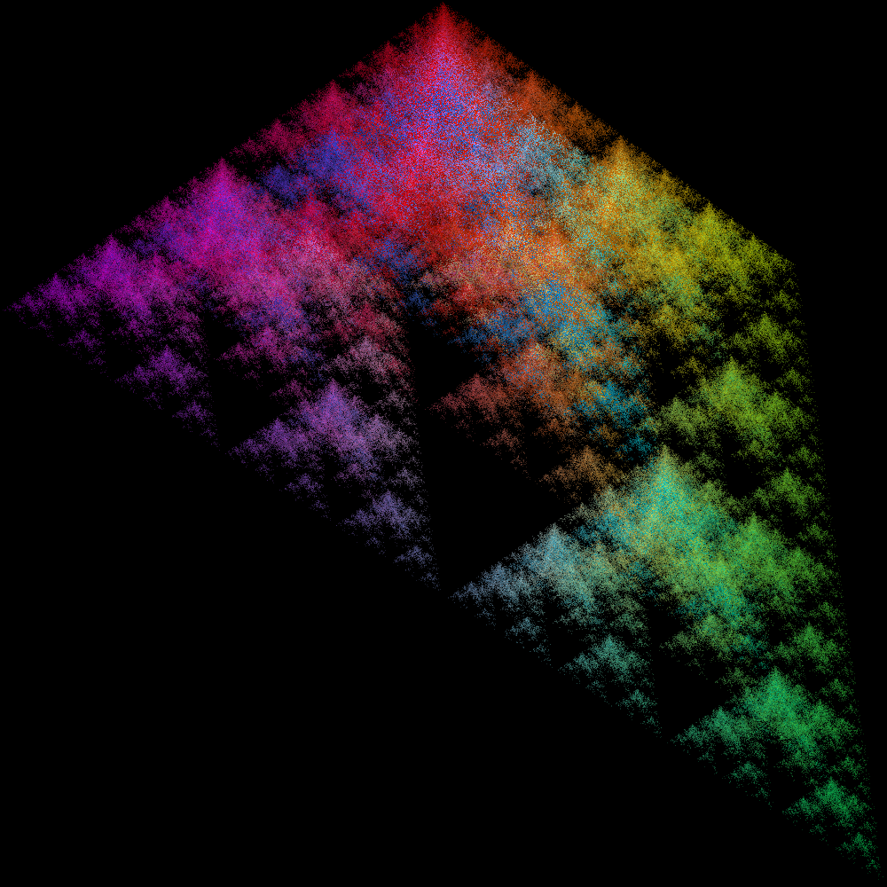

# Fractal Flames

Fractal flames are images produced by placing points according to rules depending on randomness or the location of the previous points, known as a chaos game. Then the points can be further modified by functions that modify the whole grid of points. You can find some of the ones I've done [here](https://drive.google.com/folderview?id=1-3bBA0azBAzL2a3q6sER0sO8IRdL3Q2Z).

**Some of my favorites:**

### *Shoutouts to Simpleflips*

### *Cool Barnsley*

### *Pix*

### *Disturbance*

### *Spectral Mountains*

