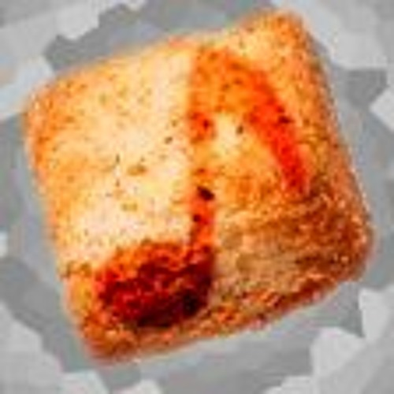

# Music

Here's a collection of songs that I wrote and made myself. I usually make all my music using the Caustic3 mobile or desktop app. My music tends to be loosely 8-bit or electronic.

## Album-a-Day 1: Vising Day

An album following the [Crap Art](http://crapart.spacebar.org/aad/) rules, although I did complete it in 12 hours and went to bed. I also made this album on my phone or by recording instruments with my phone. You can temporarily find this album [here](https://drive.google.com/folderview?id=1-0nmUNu3FQplntFUq3NwzZOSX-eFPSKF).

## Croutone

I used to post music under the name Croutone on soundcloud before I started putting all of my projects in the same place, so if you want some of my older work, click the croutone.

Experimental Soundcloud Embed 


