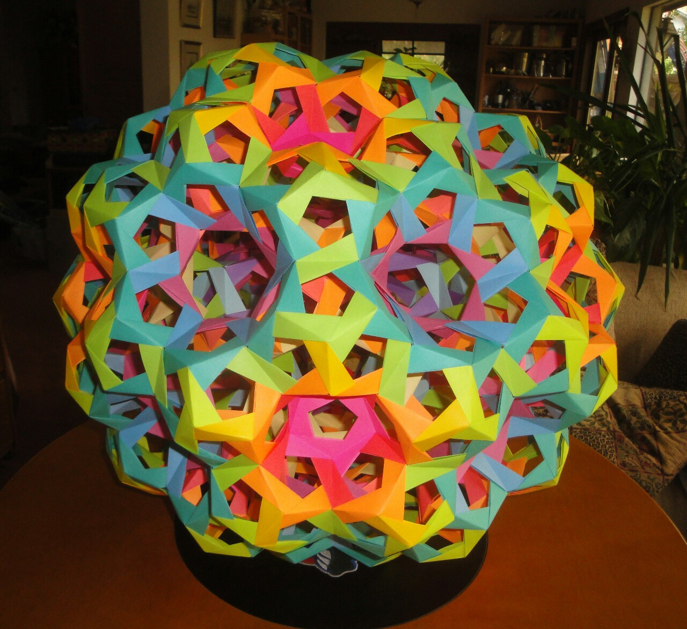
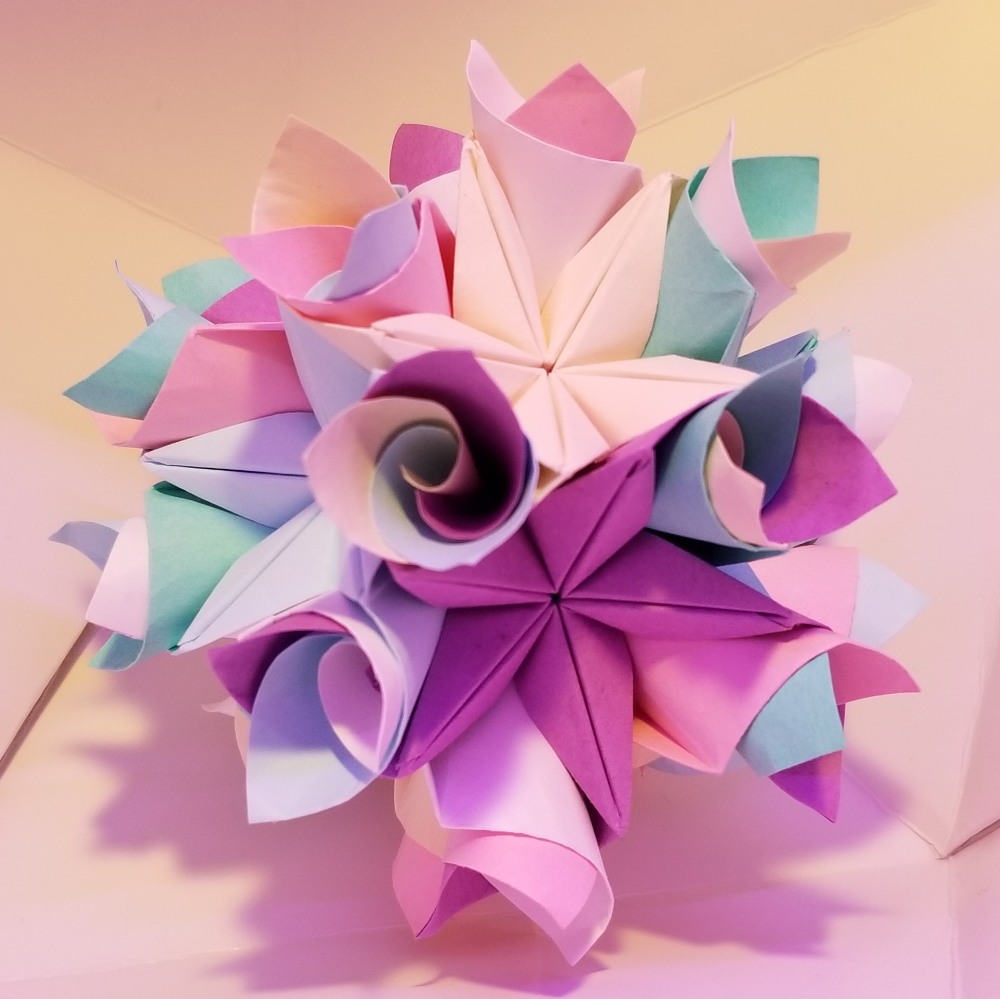

# Origami Sculptures

I've been doing origami since the 3rd grade, so it's become part of my identity at this point. I specalize in large modular pieces and tessellations. You can find some of the ones I've done [here](https://drive.google.com/open?id=16__3KvT0rn76e0jXwq-3lS9RcIl-sSL7).

**Some of my favorites:**

### *Pendelica*

### *Biohazard*

### *Flower Curler Extended*

### *Jade 94*

### *Lion's Mane*

### *Buckle Ball*

