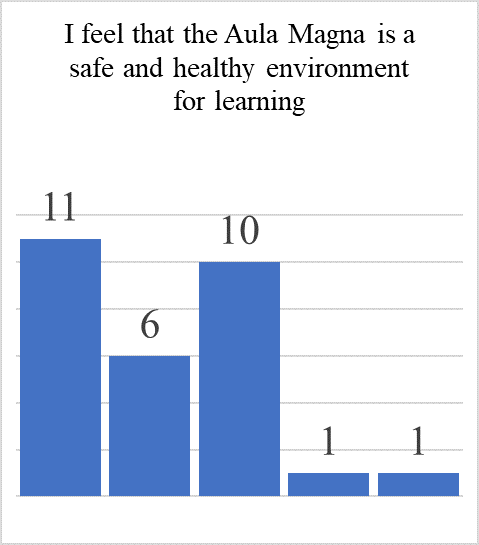

# Project Autodesk

## Table of Contents

* Article I. Introduction

  * Project Conception

  * Project Goals

  * Project Scope and Description

  * Group Members and Roles

* Article II. Project Planning
  
  * Best of Class Review

  * Tracking Success
  
  * Student Survey

  * Problems Encountered
  
* Article IV. Project Execution: Phase One

  * Initial Progress
  
  * Prototype Preliminary Ideas
  
  * Prototype Idea Refinement
  
  * Proof of Concept
  
  * CAD Modeling

* Article V. The Next Steps

  * Implementation Materials Selection
  
  * Implementation Budgeting
  
  * Prototype Materials Selection, Budgeting, and Construction

* Article VI. Project Execution: Phase Two

  * Implementation Materials Selection
  
  * Implementation Budgeting
  
  * Prototype Materials Selection, Budgeting, and Construction

* Article VII. Project Review
  
  * Project Conclusion

## Introduction

### Project Conception

The team’s first step in choosing a project to work on was identifying that the project should benefit the students at Florida Polytechnic University. Initially, ideas for projects revolved around gaming, given that all team members had an interest and experience in some form of gaming, and there were many resources available to facilitate the development of the project. The idea of an educational board game was considered, revolving around calculus or circuits. Both of these subjects are non-intuitive, and hence why it was felt that the board game would be beneficial to the students at Florida Polytechnic University. However, it was later decided that a gaming-related project may not be pursued due to difficulties in planning how the board game would be further developed, and that the team motivation for working on the project was low.

The idea that the team has chosen to work on was first conceived when one of the team members brought up that the elastic “bungie” chairs on campus could benefit from having tables attached to them, and that the team project could revolve around improving the university’s amenities to better reflect a learning environment. The idea was formalized by the project manager, who has a class that was located in the Aula Magna, the auditorium of the Information, Science, and Technology (IST) building. He identified how uncomfortable it was to have a class in the Aula Magna due to the lack of writing surfaces, poor sound projection, and poor visibility in the lecture space. Given this opportunity to improve the school, the team has decided to make the Aula Magna a more effective and comfortable lecture space.

### Project Goals
The goal of this project is to change the Innovation, Science, and Technology building's Aula Magna from a stadium-style auditorium into a proper lecture auditorium. This could be done by working on the following sub-goals:

1. Adding writing surfaces for students to take notes or tests on.
  
2. Improving the acoustics by minimizing echo and background noise.

3. Making the seating more comfortable by adding back supports.

4. Increasing the visibility of the lecturer to the students.

Additionally, these improvements should be designed to be reversible so that the lecture space can move back to a stadium space to accommodate the different needs of those using the space.
Project Scope and Description
Within the time span of one semester, the team has identified that the scope of this project will consist of goals one and three. The metrics for achieving these goals are as follows:

1. Develop a single unit prototype desk and chair model, the Autodesk, which will satisfy the aforementioned goals judged by fellow students during the final presentation. Unit of measure: survey score.

2. Determine the cost of materials, construction, and installation for implementing the prototype across the entire auditorium. Unit of measure: dollars.

3. Formalize a written plan on how the materials, construction, and installation of the prototype may be done without violating school codes or disrupting current use of the space, and have that plan's feasibility deemed by a faculty member of the university. Unit of measure: binary.

4. Maintain a record of past, present, and future work, provide presentations, and complete class learning assignments and tests to satisfy the learning criteria and expectations of the professor overseeing the project management class. Unit of measure: class grade.

### Group Members and Roles
Team Insert_Name_Here, consisting of Pete Carter, Michael Walen, and Matt Giallourakis, have identified the roles necessary to optimize the project metrics. The roles were assigned based on each team member's prior project experience, skills, and work capacity. The assignment of the roles, expectations, and qualifications are described below:

#### Project Manager and Head of Construction: Matthew Giallourakis
As the Project Manager, Matthew Giallourakis (Matt) is responsible for the direction of the project, and is accountable for the success of failure of the project. This role includes: determining what tasks must be completed to complete the project and what resources are needed for those tasks, resolving all conflicts both within the team and between the team and the environment, examining the past, present, and projected progress of the team, and making sure that every member of the team knows what they are responsible for and briefing them on any changes in direction or scope of the project. Matt was chosen for this role because he has the most leadership experience on the team. He has been the project manager of three projects at Florida Polytechnic University, and has managed and led numerous social outreach programs through his local library. As Head of Construction, Matt is responsible for the dimensioning, resource ordering and acquisition, and construction of the prototype desk module that will be presented during the project final presentation. He is qualified for this role as he is the only member of the team that has experience with mechanical engineering and prototyping, and he has created a prototype furniture model in a previous project here at Florida Polytechnic University.

#### Head of Scheduling, Head of Records, and Head of Research: Michael Walen
The tasks set out for Michael Walen as the Heads of Scheduling, Records, and Research include: making a reasonable and efficient schedule for work on the project, recording what is discussed in each group meeting, organizing the main project report, gathering information on similar projects and where they succeeded or failed, and giving assistance to the other group members. This role inherently requires constant communication with the other group members, as the scheduling and the meeting notes require input from the other group members. Michael was chosen for this role because of his observation skills, and his ability to organize documents efficiently.

#### Head of Presentations and Head of Computer Design: Pete Carter

As the head of Presentations and Computer Design, Pete Carter’s job is twofold: his first and possibly most important role is that of the team’s digital designer. Using standard SolidWorks and/or Autodesk software, he will take the final design on paper and translate that into a digital format to present.

He was chosen for this job due to his experience in digital design, proven by his certification in Autodesk Inventor and AutoCAD programs, and has been using Autodesk tools since he was in middle school, and continued to do so until his graduation in high school. There is no one more experience on the team who can fit this role.

His second task is to create the basis that will become the PowerPoint for the team’s presentations. Though he has less experience with this compared to his knowledge in Computer Aided Design programs, he has used PowerPoint multiple times in multiple classes in past semesters, and throughout his last two years in high school. However, unlike his role as Head of Computer Design, this is not a task he will complete entirely, or even mostly, on his own. His role is merely to create a basic presentation using the Microsoft PowerPoint application, which will then be edited and critiqued by his teammates as events progress throughout the semester.

## Project Planning

### Best of Class Review

One great example of an auditorium done correctly is the Steve Jobs Theater at Apple. Now, while no one is expecting Florida Poly to spontaneously gather the funds to create a single building, smaller than the Innovation Science and Technology building, and yet somehow worth more than what it cost to make the entire Florida Polytechnic campus property, it is good to look at what makes something else so successful.

First and foremost, the Steve Jobs Theater accommodated its viewers with comfortable seating. This is something that should be expected for ALL important theaters or auditoriums. More than that, the theater is angled just enough to see over the next row, but not so much so that it would be painful for one’s neck to look down at the speaker, or worry that one may fall all the way to the bottom of the stairs when talking down the aisles.

One might wonder why these are being brought up when there is very little that can be done to the Aula Magna at this point. And that is (unfortunately) very true. Because the one thing that Foster + Partners (the architectural group that worked on the Steve Jobs Theater) will brag the most about their creation is how much space it has.

Theaters and Auditoriums alike need some semblance of space to bring further attention to the center stage. And there was not enough space in that particular corner of the IST building to put even a half decent auditorium. Additionally, while Project Autodesk cannot fix every problem with the Aula Magna, it will certainly fix one of the bigger issues that many students have with it. The hope of this team is to bring to the Aula Magna something that not even one of the most expensive auditoriums in America has: retractable tables.

### Tracking Success 

Now that it is one month after the initial project plan was created, it is time to review the key aspects of what makes a project successful. Outlined in the Standish Group's “Chaos" report, the following 10 attributes were observed across different projects, and their importance were determined by the success or failure of the project. Those 10 attributes and their weight out of 100 are below:

1.	User Involvement (19 pts.) X
2.	Executive Management Support (16 pts.) 
3.	Clear Statement of Requirements (15 pts.) 
4.	Proper Planning (11 pts.) X
5.	Realistic Expectations (10 pts.)
6.	Smaller Project Milestones (9 pts.) X
7.	Competent Staff (8 pts.) 
8.	Ownership (6 pts.) X
9.	Clear Vision & Objectives (3 pts.)
10.	Hard-Working, Focused Staff (3 pts.) 

Team Autodesk has determined that the project score at the end of the last milestone was 55 points, meaning that the success of the project at that time was at the flip of a coin. Thus, it was decided that the best move would be to improve the score to ensure the success of the project.

### Proper Planning and Smaller Milestones

The next aspect that could be improved is the planning of the times that the project is worked on. While the Work Breakdown Structure and Gantt chart are well developed, all of the team members have underestimated the weight of other activities, classes, and responsibilities on their time available to work on the project. This leads to constant rescheduling to fit tasks within the report dates. As such, the next step is to establish dedicated blocks of time with fine granularity to work on the project, and accomplish weekly milestones.

### Ownership

Due to the nature of this project, it is unlikely that a sense of ownership will develop out of the prototype or implementation plan, so the best chance of fulfilling this is to put the most effort into the final report and the final presentation.
 
### Student Survey

This project, as hopefully recalled, is to renovate the Aula Magna for lecture use for the students of Florida Polytechnic University. Up until last milestone, however, the team had not worked with other students that currently had lecture in the Aula Magna. In order to get input from students (the potential users), A survey of the effectiveness of the Aula Magna was given to a group of students that have Dynamics, a particularly challenging course, in the Auditorium. A copy of this survey can be found in Appendix B, the raw data can be found in Appendix A, and the results and analysis of that survey are below:

Most of the questions were in the form of a statement, and the students were to choose the level to which they agreed or disagreed with that statement. Here is one of the questions, where the leftmost bar represents the students that strongly disagreed (or would if any had chosen that option), and the right, the students that strongly agreed. This chart shows that most students in the class feel that the current state of the Aula Magna is negatively affecting their ability to learn.

This question is the most direct in assessing the student’s needs and opinions. All but one student agreed, most strongly, that the Aula Magna should be improved for lecture use in the event that the university decides to continue holding classes in it. This gives validation that this project is worth pursuing, and that the potential users may be more involved in the project.

It is also important to note that the Aula Magna not used just by the students, and that teaching in the Aula Magna is a problem for the professors, and that the professors of the university are stakeholders as well. The team had hoped to get professors’ opinions about the Aula Magna, all but one had declined to answer. Luckily, the one professor who gave his opinion exclaimed that is awful. It is interesting to note that, unlike mostly all surveys of this kind, no student has selected the neutral option for an agreement question.

The following questions were designed to have a wider variation in answers, as asking a question about fairness is fundamentally different from a question about difficulty. Most of the students agreed that not only is having lectures in the Aula Magna more difficult for both the students and the professors, but this question demonstrates that the majority of students expect that their performance and acquired knowledge is of a fundamentally different kind than students who are learning in a traditional classroom space.

This question was deigned to be the most variant to calibrate the survey, as a survey is less useful if every responder picks the most extreme option every time. While most students feel that having lecture in the Aula Magna is not worth dropping out, about 1/3 of students still feel this way, which shows that the current state of the Aula Magna is simply unacceptable.

The responses to this question show that the students feel that being in the Aula Magna is not only dangerous to their GPAs, but dangerous to their lives in general. The Aula Magna is steep, and mostly concrete, which means that falling is both a likely and a dangerous scenario. Adding table space to the Aula Magna hopefully will prevent students from falling out of their seats, or at least give them something to hold onto.

Finally, four of the questions dealt specifically with how the surents thought the Aula Magna should be improved, alinged with the possible ways of improving the Aula Magna that the team had identified at the project conception. Here it is shown that two thirds of the students feel that the Aula Magna’s acoustics should be improved. Honestly, the team thought this staticstic would be much higher, but as one of the students put in the comments section of the survey, “The acoustics are bad but don't affect my ability to learn.” While this probably would have been one of the esiest things to fix, this question shows that it was not worth investigating further, as it did not align the most with the user’s needs.

This question was easily the most surprising to the team. While it is hard for some of the students to see the professor sitting in the back of the Aula Magna, most classes are small enough for many of the students to sit closer to the professor than other classrooms. This is still an issue, though, because the slope of the seats makes it hard to view the whiteboard. As one student writes in the comments on the survey, “Add an Elmo (a digital overhead system) because the whiteboards are useless.”

This question addresses the main focus of the project thus far. Twenty-seven out of the twenty-nine students surveyed agreed that the Aula Magna needs table space if it is going to be used for lectures. As stated before, the Aula Magna does not have any writing spaces, leaving students to bring clip boards, textbooks, laptops, and other surfaces to write on, but also to hold while doing so, making the act of taking notes more of a physical exercise than a mental one. This reaffirms that the project and efforts have been to satisfy the user’s needs.

Finally, and surprisingly, one student thought that the current state of the Aula Magna’s seats was acceptable. The seats of the Aula Magna do not have backing, and the seat behind jets out, leaving approximately two inches of back support. Adding back support is as simple as adding wooden slabs with padding behind each of the seats, and may be added to the project moving forward.

### Problems Encountered

In terms of the challenges faced during this project, one of the biggest was the reliance on the university’s facilities to provide a proper layout of the Aula Magna. Since they weren’t allowed to disclose the blueprints of the building online to anyone for any reason that didn’t involve maintenance, it took some time before the team could speak with John White. With the amount of time that it took to finally speak with him in person, and get a proper layout of what we needed, the team was already far behind schedule. Without the layout of the Aula Magna, the team wasn't able to finish the final design planning of the Autodesk as soon as what would have been liked. While the basic design was finished, it wasn’t known if that design could accommodate for the curvature of the Aula Magna. This delayed how soon the team could get a proper cost analysis on the construction of the Autodesk; moreover, it just slowed most of the progression of the project.

## Project Execution

### Initial Progress

When the idea to make a desk for the Aula Magna was set in stone, the team set out to measure the dimensions of various aspects of the Aula Magna. Unfortunately, the Aula Magna was built with slight curvature, which made accurate measurements of the seats, stairs, and walls nearly impossible with traditional tools. Upon discovering this, the team decided to contact the University’s facilities to get blueprints of the Aula Magna that included the radius of curvature, and seat and wall dimensions, so that the team could begin prototyping with accurate measurements.

The team immediately requested the floor plans of the Aula Magna from the University Architect, John White. The team didn’t get a response for a week, and decided it would be best to try to meet him in person; but when the team arrived at his portable, it was revealed to us that he was on vacation, and that he wouldn’t be back until the next week. When Mr. White got back, the team asked for the floor plans again, and he informed us that the floor plans of the Information Science and Technology (IST) building could not be made public. The team didn’t hear from him for a couple weeks, but the team had to focus on getting the first deliverable finished and submitted.

A week after the first deliverable was turned in, Mr. White was able to send us the design sketches for the Aula Magna. The sketches were sent by email in a PDF, but the resolution of the images was too small for any of the text or measurements to be readable. The team informed Mr. White of this, and then it was decided that the team would meet him in person. During the meeting, he showed us the floor plans of the IST, and he told us that he would give us both digital and physical copies of it. On the next week, the team received the copies, and the team could now begin working on the construction of the prototype.

### Prototype Preliminary Ideas

As is written in the introduction to the project, the team knew pretty soon on that the project was to renovate the Aula Magna in some way for the students of Florida Polytechnic University. It was determined that the best course of action was to add some way for the students to sit more comfortably, and also have some writing space.

The original concept sketches for adding table space and more comfortable seating to the Aula Magna was to have a seat and table hybrid. This design shows a seat that folds flat linked to an arm with a small metal writing surface and legs for support. The idea behind the folding mechanism is that the seats would be deployable when students needed them, and collapsible into a small area and stored when use was not needed.

The team considered this idea, but given that there was no space near the Aula Magna to store the seats, the design was complicated and had multiple moving parts, and it would take a while to deploy, the team decided that it would be infeasible to build a prototype, and would probably not be worth the effort.

### Prototype Idea Refinement

The design hasn't changed much from the original concept sketches, but the mechanism has been finalized and is currently undergoing CAD modeling. The Autodesk mechanism is a rising table that acts as a seat when not in use. Each row of seats is divided into three tables that can be extended individually. The idea for the mechanism came from folding piano keyboard stands, which uses a scissor lift mechanism to make a horizontal surface of variable height for the keyboard to stand on.

Unfortunately, there are two problems with using this design directly. The first problem is that the feet of the mechanism must be allowed to move freely, so the mechanism cannot be directly fixed to the floor of the Aula Magna. The second problem is that the mechanism is unstable when force is applied to the front, even if the feet are fixed. Seeing as there will be people directly in front and behind the desk, this poses a serious risk.

The chosen solution to these problems came from a TV tray mechanism, where there are two scissor lifts on opposite sides of the mechanism. Thus, the solution is to build a compound mechanism that uses two scissor lifts per desk. This adds both a way to fix the mechanism to the floor, by holding one leg of each scissor steady and letting the others slide freely in an enclosure, and it adds more stability by doubling the amount of beams, and distributing the force to the corners of the mechanism.

### Proof of Concept

The proof of concept for the mechanism is this model here, made out of neon drinking straws. Each image shows one-half of the mechanism. The top image shows the mechanism fully closed, while the bottom image shows the mechanism halfway open. 

The orange straws represent the bottom and top surfaces of the desk. The bottom surface is fixed to the floor, and the top surface is both the seat when the mechanism is contracted, and the writing surface when the mechanism is expanded.

The mechanism works by sliding the right foot towards the left foot, which is pinned to the floor. As the right foot closes in, the angle between the bars across the horizontal closes, and the distance between the bars across the vertical expands.

The fact the mechanism was functioning using only straws is a good sign that the mechanism will work with sturdier materials, such as metal sheeting and pipes, and wood. 
 
### CAD Modeling

Pete Carter, as head of Computer Aided Design (or CAD), began working on the three dimensional model for project Autodesk. For this process, Pete utilized Autodesk Inventor, which he specializes and is certified in. Despite not being available in most Florida Poly computers, to which Solid Works is, Autodesk Inventor was chosen, not only because Pete is so experienced and familiar with the program, but because Autodesk programs generally have a presentation mode that meshes well with Microsoft programs, allowing for our team to comfortably show off the model while using Microsoft PowerPoint. 

While Pete is aware of this feature, he is not certain on how he can utilize it. More than that, while PowerPoint supports three dimensional models from other software, such as Solid Works, it does not support those from Inventor, for some reason. If the Autodesk presentation mode fails, then Pete will recreate the models using Solid works, and we can present the models in the PowerPoint that way.

Over all, the process was supposedly very smooth, and the Inventor file was completed in less than half an hour. However, that is not to say there were not any difficulties along the way. Because Pete had downloaded his Autodesk Student Software four years prior, they had expired, and Pete had to make a new student account, this time under Florida Polytechnic University instead of his High School. Though this was a difficulty that lasted only a single weekend before Autodesk verified Pete’s student ID so he could get back to work, it was still another difficulty nonetheless. 

## The Next Steps

Now that the mechanism is designed, the next steps are to choose appropriate materials for the lifting desk and back rests, and then cost them out for both just the prototype, and the whole installation, along with the estimated cost of modification of the current seating. Then, the installation plan will be written out, including how the current seats will be removed, how the base for each Autodesk will be installed.

### Implementation Materials Selection

In order to provide the optimal desk and seat experience, the materials of the mechanism will have to be evaluated for strength, weight, and cost. It is very likely that the crossbeams in the scissor lifts will be one-inch diameter aluminum tubes, the bottom and top mechanism cases made of sheet metal and wooden blocks, and the top a thin layer of wood to replicate the look of the current seats without the weight. Experimentation and theoretical analysis of different materials is the next step in the project. It is very likely that the padded wood currently used for the seats will be appropriated as the back rests.

### Implementation Budgeting

An analysis of how the wooden seats are affixed to the concrete will have to be performed. After speaking with Dr. Christopher Coughlin, the team has found out that if the seats are affixed with a certain kind of epoxy, then the task of removing the wooden seats will come down to some combination of heat treatment and chemical solvents- most likely acetone. Then, the cost of each of the materials will be added to a base rate of how long it would take to construct and install each desk and back support. This should give a rough estimation of the cost of entirely renovating the Aula Magna with Autodesks. 

### Prototype Materials Selection, Budgeting, and Construction

Once the materials for the implementation are picked out, modifications will be made to what materials will be selected to construct a prototype. Unlike the implementation budgeting, the prototype budgeting will have to be more accurate, but will also be less complicated. The prototype budgeting goal will to be to estimate how cheaply the team could make the prototype to within the allowed budget of zero dollars. It is very likely that the team will buy two keyboard stands and construct a plywood casing around the feet and arms of the scissor mechanisms, but more market research and cost analysis will have to be performed.

## Project Execution: Phase Two

### Computer Aided Design

One issue that was encountered during the computer aided design process of digitally constructing the Aula Magna Autodesk was trying to redesign it for a three-dimensional print. We still were not certain if we could 3D print a smaller scaled assembly version of the desk, but it was thought that designing the desk with that in mind would have been better overall (that is, until the study was made regarding how much effort we should have been focusing on this project in the first place). Though, it was at least thought that we could have some form of small replica for the final presentation (be it 3d printed, or simply constructed out of much less practical materials, such as straws).

Because of this, the desk needed to have slightly more space in between the piping that held up the desk and the desk itself, if it were to be 3d printed that is because there was so little space that the PLA material might have molded with one another during the 3d printing process. Pete altered the desk just a little bit, but the alterations had to be made to all 3 different designs of the desks, and the process created some issues in trying to keep the dimensions of all of the desk similar to one another, and it came to the point that even the piping had to be redesigned to a certain extent.

And while the design was properly suited to be 3D printed, it was determined that the assembly could not be 3D printed the way that it was designed. In order for it to be 3d printed, it had to be done so directly from the assembly version of the CAD file. The reason it needed to be 3D printed as an assembly was because the pieces themselves were not designed with manual assembly in mind, and this could also be attributed to the amount of effort we decided should be spent on this class. 

Another issue with the computer aided design was a slight misinterpretation in communication and instructions. The way that the piping was meant to support the table was not exactly expanded on, and some mistakes, in terms of the interpretation of how the table went together, were made which caused the digital design to be delayed a little more. It didn’t help either that Pete was still trying to get the design ready to be 3D printed, only to learn that, in the end, that was, unfortunately, not going to happen. This caused him to have to redesign the piping and the main table, or at least certain aspects of those parts of the assembly, in order for them to fit together properly. 

After all that had been completed, the only things Pete had left to do was the PowerPoint presentation, and the rivet design of the Aula Magna to fit the Autodesk into. Out of those two the Autodesk Rivet design of the Aula magna was not mandatory, and would never be seen to completion. Aside from the fact that Pete knew less about Autodesk Rivet than he did about Autodesk Inventor, between the current assignment at hand and the need to study for finals, not to mention the before mentioned recommended amount of time that should be focused on this particular project compared to other classes, it was determined that such an endeavor was too time consuming for a project that would likely never come to reality. More than that, it was very unlikely this would ever actually come to reality, seeing as new buildings would likely replace the need for the Aula magna (assuming those buildings don’t come with problems of their own).

The most that was expected of him at this point was to simply finish the PowerPoint presentation. Upon completion we would then meet and go over who would say what during the presentation, as well as create any necessary edits and changes to the PowerPoint presentation. Much of the new presentation was similar to the first one we made a month ago. The only difference was the focus.

This time around we were going to actually sell our idea (or at least act as though that were the case) and redesign our PowerPoint presentation accordingly, as opposed to the last one which simply recapped our progress made so far. Besides that, there is next to no reason to change something that honestly does not need changing in the first place, which is why certain slides were copied and pasted directly into the new PowerPoint presentation.

But back to the Revit design, although it was no longer seen reasonable to be able to finish a 3D design of the Aula Magna to fit the Autodesk into, that did not mean that it was impossible to do the same thing but slightly differently. It was possible that we could edit the dimensions of the Autodesk over the PDF of the Aula Magna floor plans to show off just how well this might work. This was yet another idea that was simply tossed around, and we still were not sure if it was actually going to come to fruition.

### Prototype Materials Selection and Construction

The prototype consists of only two parts: the leg mechanism and the material surface. The leg mechanisms were purchased from Amazon as part of the “Flexzion Piano Bench - Keyboard Bench Height Adjustable Foldable X-Style Padded Stool.” Each stool costs \\$39.97, and two were used for the prototype. The legs were unscrewed from the padded seat, and the clips and braces were put on the side.

The next step was to purchase a 0.5” × 49” × 8’ MDF (Medium Density Fiberboard) panel for \\$26.99, and a bottle of normal wood glue for \\$3.99. The panel was cut at Lowes. The legs and fasteners were attached with a 1’ × 6’ panel on the top and bottom, and the 
3” × 6’ front and back planks were glued on. 

The finished prototype measures 3” × 1’1” × 6’ when closed, and 1’10” × 1’1” × 6’ when open, meaning that the Autodesk is barely noticeable when in the collapsed state, and almost two feet tall when expanded.

The Autodesk was brought to the school for one day thus far, and became immediately popular as a table, given that so many of the seats in the IST are less than two feet off the ground, and the provided tables are too low to the ground. Another team from the same project management class asked if they could use the Autodesk prototype as a table to work on their own report. This gives validation to the prototype’s use as a work desk, even outside of the Aula Magna. 

### Implementation Materials

There are a couple key changes that would be made to the prototype if it were to be implemented to renovate the Aula Magna for classroom use. First, the fasteners for the legs of the mechanism would be screwed directly into the existing infrastructure, thus saving cost on building materials.

Second, the MDF would need to be sealed, because MDF is notorious for adsorbing liquids, which would eventually rot the wood. Sealing would be done by applying one or two coats of Leyland Trade Acrylic Primer and Undercoat, which would give the Autodesk a polished white surface, matching the walls and other desks found throughout the IST. Finally, the manufacturers that make the Flexzion Piano Bench would be contacted to see if the legs could be sold independent of the padded seat covers, and if there would be a bulk wholesale discounts.

### Implementation Budgeting

This section will contain the maximum expected cost to renovate the Aula Magna based off of materials used to build the prototype, extra materials that may be needed, and unforeseen costs.

**MDF** 

There are three different sizes of desk that will be needed to account for the rows further up being longer. There will be four desks of 5.5’ length, two of 6’ length, and four of 6.5’ length. Each Autodesk will require a sheet of MDF 1.5’ wide, so in total, the total implementation will require 90 ft2 of MDF. The MDF from Lowes costs \\$0.77/ft2, so the total cost of MDF will be \\$69.30.

**Leg Mechanisms**

The legs will be independent of the size of the desk, meaning that each of the 30 desks will require 2 leg mechanisms each. Each leg mechanism purchased as part of the Flexzion Piano Bench would cost \\$39.97. Thus, the total cost of the leg mechanisms is \\$2,398.20.

**Painting**

Leyland Trade Acrylic Primer and Undercoat. Each 2.5 Liter can of primer can cover 350 ft^2 and costs \\$19. The total surface area of all desks is about 180 ft^2, so one can of primer should suffice for painting all desks given one coat of primer. Two coats would require two cans, at \\$38.

**Auxiliary Materials**

For the prototype, Titebond Original wood glue was used to attach the side planks to the top panel. For the actual implementation, using Titebond II would provide more water resistance and a stronger bond. Two bottles of wood glue should suffice, costing at most \\$20. Additionally, 1 inch screws can be added to attach the side planks to the top panel. Each desk would require 6 screws, making 180 screws. A box of 200 flush screws costs \\$17.

**Labor**

The prototype took a total of 8 hours of labor to build without the use of a woodshop. Estimating a wage of \\$12/hr and 8 hours of labor per Autodesk, the total labor cost would be \\$2,880.

### Total Implementation Cost

Summing the costs involved with installing all Autodesks, the total comes to \\$5422.50.
Adding in a 10% buffer for unknown costs and project overruns brings this total to \\$5986.75.

### Total Implementation Cost

Summing the costs involved with installing all Autodesks, the total comes to \\$5422.50.
Adding in a 10% buffer for unknown costs and project overruns brings this total to \\$5986.75.

## Project Review

### Project Conclusion

We believe that team Insert_Name_Here has succeeding in creating a viable Autodesk prototype and implementation cost estimation that will greatly benefit the students that use the Aula Magna for lectures. Not all the elements of the project have been completed by the time of this report; however, if the students and faculty show enough interest in the implementation of the Autodesk, our team will pursue finishing all parts of the project, including a more complete manual for making an Autodesk, exactly where the Autodesks will go, and working on additional ways to improve the Aula Magna such as improving the back support and technologies used in the space.

We are excited to present our ideas to the other students, and will be ecstatic if we get the same reaction from our peers as we did during the trial run. Many students responded to seeing the Autodesk in action with “Wow that’s actually a really cool and practical idea, I hope it actually gets installed,” or similar words.

Finally, we would like to thank Prof. Mennie, for pushing us to succeed in a project that we are interested in, that hopeful will have a real positive impact on our school, and can use on our resumes and in our futures. 

