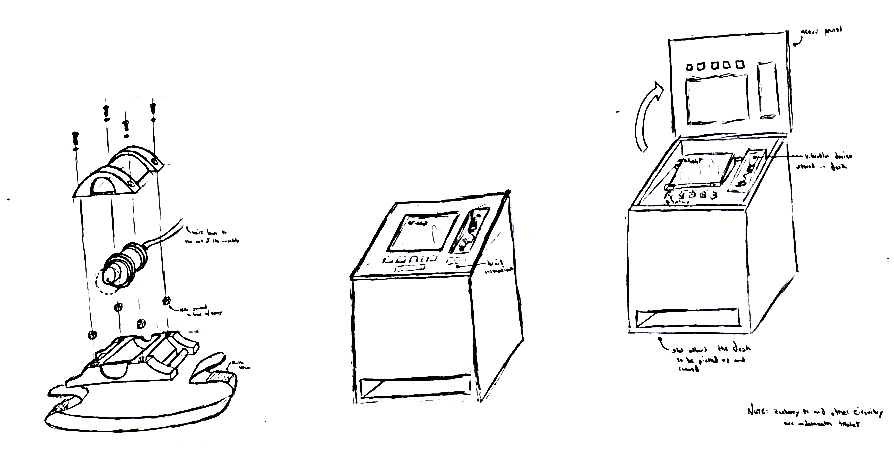
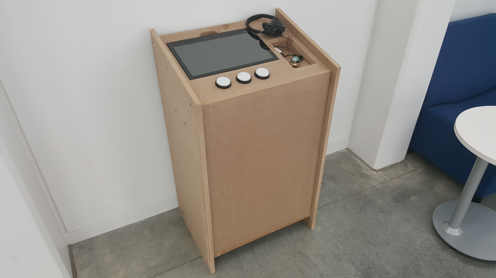
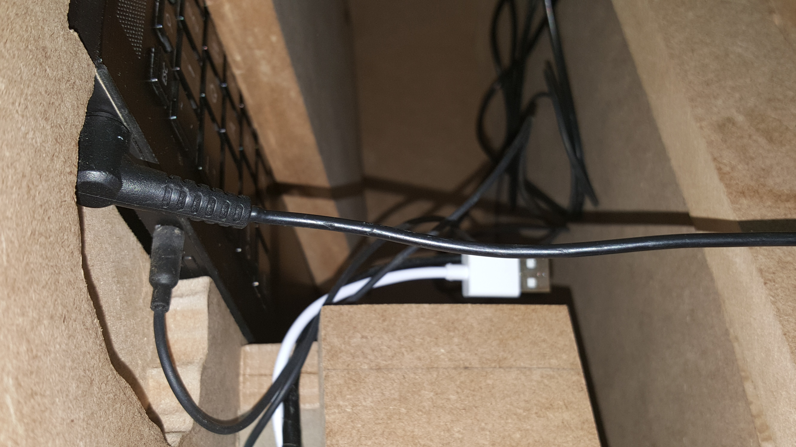
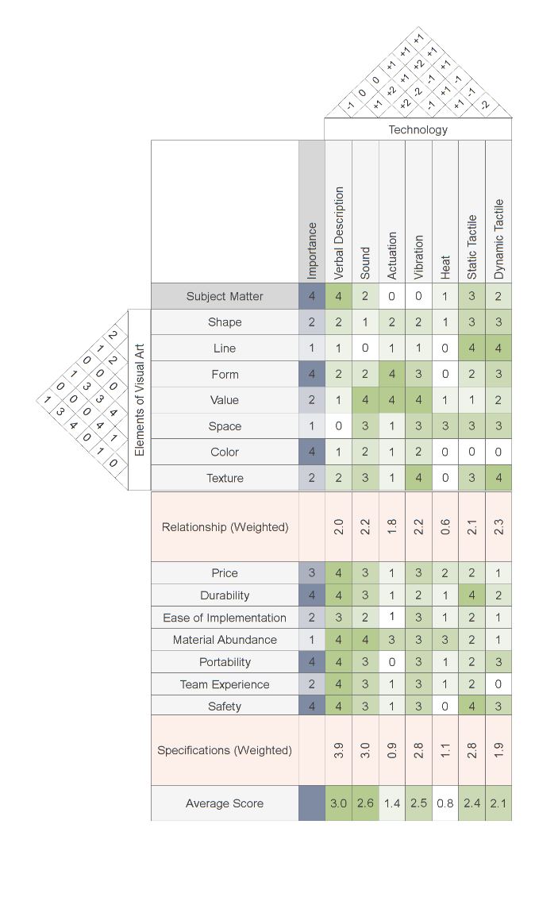
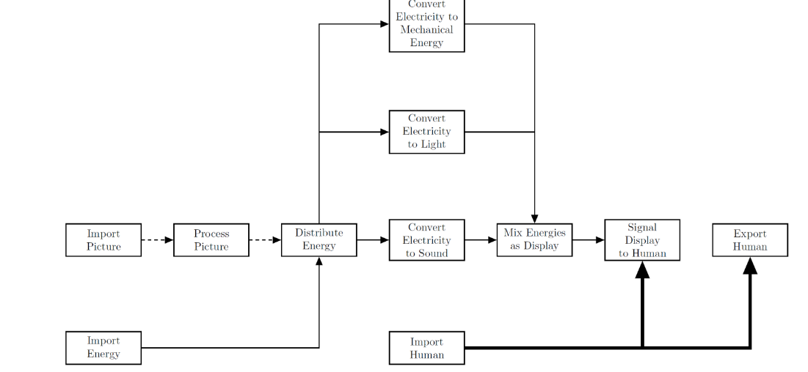

# The Design and Implementation of an Interactive Art Learning Experience for the Blind

## 1. Introduction
The goal given to our design team (Polk Blind Art) was to create an interactive experience to aid in teaching the elements of visual art to the blind. This goal was to be realized in the form of a standalone art exhibit restricted to constraints listed in section 2.2 This project was submitted by the Polk Museum of Art to Florida Polytechnic University for a team of three to five undergraduate engineering students to create a prototype satisfying the problem description as a learning aid.

The first step in solving this problem was to review art theory and similar projects that have been attempted, and evaluate what potential solutions would most effectively asses this goal. The elements of visual art are the common themes apparent in the majority of visual art forms: color, value, space, line, shape, form, and texture. The composition of these elements are associated with different common experiences (red, orange, and yellow are “warm” colors, symmetrical and repeated shapes represent “order”) and therefore contribute to the tone of the work. Similar projects primarily only focused on the elements of form and shape, which are elements that the blind are the most familiar with. 

This information combined with other design analysis methods revealed that a solution that used sound and vibration to convey color and value information of a digital image. After many iterations of action plans, software, and hardware, a prototype was built could satisfied the interpreted goal of the project. This is accomplished in the prototype by using a touchscreen tablet computer and microcontroller to actuate a motor and relay sound information back to the user. This system is housed in a podium constructed with medium density fiberboard. 

## 2. Customer Needs, Objectives, and Team Interpretation
The Polk Museum of Art requested an interactive artwork learning experience for the visually impaired, specifically those that were born blind. The project description included the goal of the project and what physical constraints the solution must fulfil to be accepted. Because the project only gave information on what was necessary to complete the project but not sufficient, what was considered to be a viable solution was left to the design team.

### 2.1 Customer Needs
The client had no exhibits or features in their facility to offer the visually impaired. Having such an exhibit would increase the traffic to and popularity of the museum by interesting a demographic that does not usually visit art museums. Because of this exhibit at its core must be engaging and interactive to fulfil the goal of increasing traffic and popularity. How to accomplish this, however, was left to the interpretation of the design team.

### 2.2 Design Objectives
The provided constraints from the Polk Museum of Art are as follows:
* Be movable by two people
* Fit within 35 in square area
* Be reliable and easy to maintain
* Operate on Windows 10 or VMware

### 2.3 Team Interpretation
The interpretation of how to accomplish the goal set by the Polk Museum of Art was to substitute the elements of art with engaging analogs that preserve the compositional aspect of visual art. The medium to best fit this interpretation was music and other sound information, with haptic feedback as a reinforcement.

## 3. Concept Generation and Analysis of Alternatives
The design process began with an assessment of art theory and a review of similar projects completed by other art museums. From this, the project was reduced to possible design variables and technological components. 

### 3.1 Best of Class Review
A review the methods, technology, and elements addressed of similar projects was performed. While no project found matched the goal of this project, the most similar project found is the Art Education for the Blind project by Art Beyond Sight. This project used a combination of audio and braille descriptions along with braille-like tactile graphics. The drawback of this approach is that it is only minimally engaging, only the aspects of visual art most familiar to the blind are expressed, and that each art piece must be custom-made. 

### 3.2 Design Variable Analysis
Each potential technological implementation was assessed using a method known as the “house of quality,” in which each variable is considered on an array of criteria, as well as interactions with other variables. The house of quality used can be found in Appendix A as Figure A1. Each element of visual art was assessed by how important it was to teach. These values were chosen while collaborating with the Polk County ESE board. Each considered feedback system (Technology) was evaluated on how well it could express the art elements, and how much they complemented or conflicted with each other. Using these comparisons, each potential technology was assigned a “Relationship” score. Each feedback system was then evaluated on different design construction factors. Using these factors, each feedback system was given a “Specification” score. These scores were then averaged to give the final score for each feedback system. From this method, it was found that the best technologies to implement in the solution were verbal description, sound, and vibration.

Next, a system flow diagram (Figure A2) was used to determine the least complex system needed to accurately implement the input and feedback systems chosen. The inputs to the system are a picture with design elements to be expressed, energy to power the system, and the user to control and experience the exhibit. The picture signal and energy are converted to mechanical energy (haptic feedback), sound (music, narration, effects), and light (setup and diagnostics, comparison for sighted people using the exhibit). 

## 4. Prototyping Process
The project was broken down into three categories of components: hardware, software, and housing. Each category went through an initial stage and a final stage. 

### 4.1 Initial Prototype Design
The initial implementation of the software was an original script written in the programming language Python3.5 that read an image file and played pre-generated sound clips of musical chords dependent on the red, green, blue, and greyscale value information of selected image pixels. The initial design for the housing was a large box made of plywood that housed the hardware, and had a hinged top for quick access to the hardware housed below. The initial hardware design was a touchscreen tablet for touch input interfaced with a Raspberry Pi that monitored capacitive buttons for navigation of the program and actuated a motor for haptic feedback. The motor was to be housed in a 3D printed case shown in Figure 4.1.

### 4.2 Final Prototype and Implementation
The software was updated to generate sounds during runtime by implementing a sound-dedicated programming language. This along with some minor aesthetic adjustments resulted in the current version of the software. The housing design was made taller and less deep. The opening access lid was replaced with an access gap in the back of the housing, and the bottom panel of the housing was removed to allow the housing to be movable by a dolly more easily. For the hardware, the capacitive buttons were replaced with mechanical arcade buttons, and the housing for the motor was redesigned to be more ergonomic and easier to clean.  After all of these changes to the design were made, the housing was constructed using medium density fiberboard, and the hardware was integrated into the shelf of the housing. The final prototype is shown in Figure 4.2

                  
## 5. Related Design Activities
In this section, the veracity of the final prototype to the constraints provided at the beginning of the project is analyzed. All of the constraints have been met, but it is still not known whether the prototype is sufficient in solving the goal of bringing more traffic to the Polk Museum of Art.

### 5.1 Risk Examination
The prototype has little to no risk of harming the user, so risk is interpreted as the uncertainty of the prototype to conform to the design constraints. The housing with all hardware installed was carried 15 meters by two people during testing, and can be moved by one person easily with a dolly, so the first requirement is fulfilled. The housing is less than two feet in width and depth, so the second requirement is fulfilled. The third constraint is more subjective than the others; the cart was designed to be as serviceable as possible, but this cannot be fully tested and may cause potential problems in the future. The software packages run on a tablet with Windows 10, so the last constraint has been fulfilled. 

## 6. Conclusions and Future Work
This section summarizes the project and discusses possible improvements that could be made to kame the prototype a commercially viable product.

### 6.1 Conclusions and Project Summary
The final prototype built is a standalone art exhibit that meets the constraints given by that using sound and vibration to convey color and value information of a digital image. No blind participants could be found to test the effectiveness of the final prototype, so the goal cannot be said to be fully satisfied, but such a goal could not have been verified before implementation regardless. 

### 6.2 Future Work
No blind participants could be found to test the effectiveness of the final prototype. An analysis of product success can be documented in the future, if blind volunteers are found. Additionally, there are plans to complete the vibration motor feature in the wrist piece as well as attach braille function names under the arcade buttons.

## Appendix

