# Datasaurus Dozen Particle Distributions


The goal of this short demo is to explore the Datasaurus Dozen dataset, a dataset famous for having different distributions with the same statistical properties, with a technique from analyzing particle distributions: the pair distribution function. The pair distribution function is rotation and translation invariant, while most of the stats measured of these plots are not, so it is interesting to see which pair distribution plots look similar.


## Pair Distribution Plot


```python
import pandas
from IPython.display import display
from ggplot import *
from math import hypot, atan2
import numpy as np

data_dict = dict(tuple(pandas.read_csv('DatasaurusDozen.tsv', sep='\t').groupby('dataset')))

data_dict

for title, frame in data_dict.items():
    plot = ggplot(aes(x='x', y='y'), data=frame) + \
    geom_point()
    
    display(title)
    display(plot)
```


    'away'


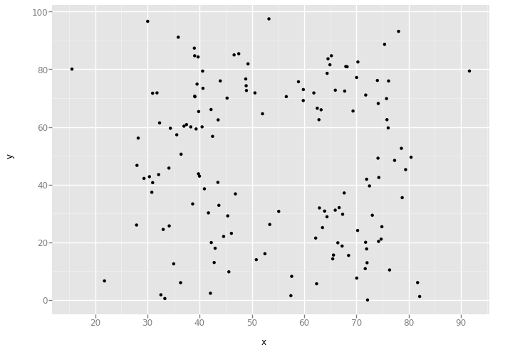


    'bullseye'


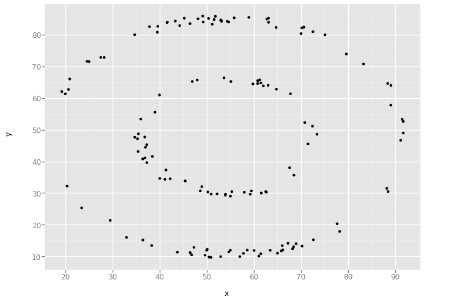


    'circle'


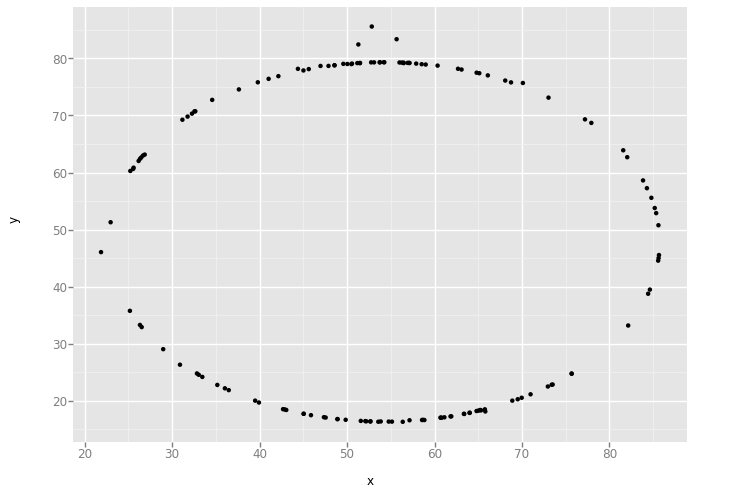


    'dino'


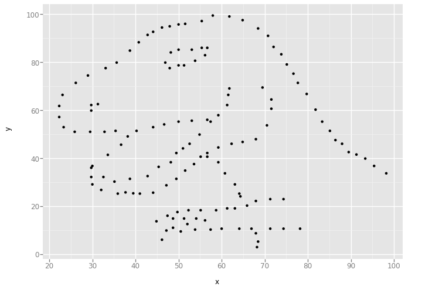


    'dots'


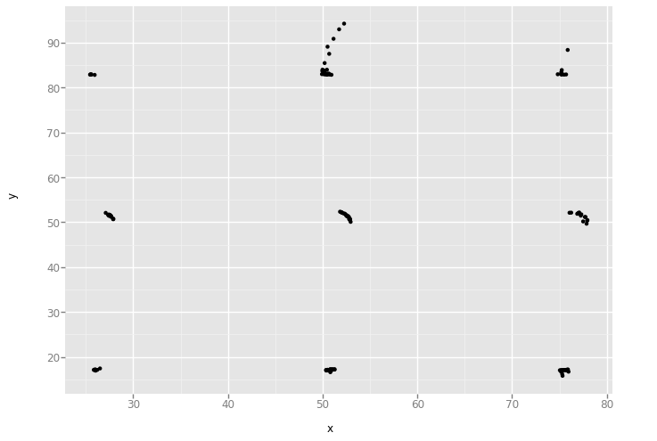


    'h_lines'


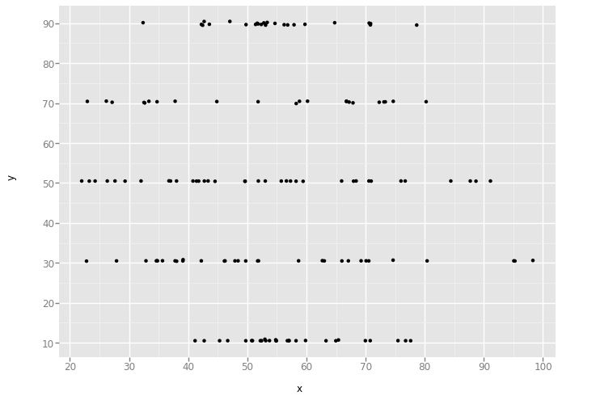


    'high_lines'


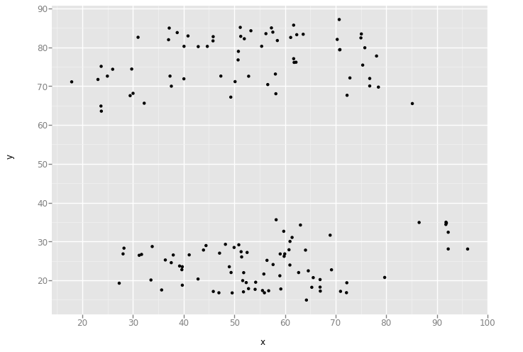


    'slant_down'


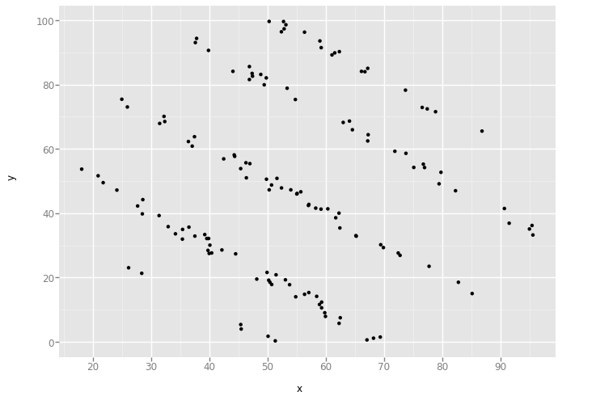


    'slant_up'


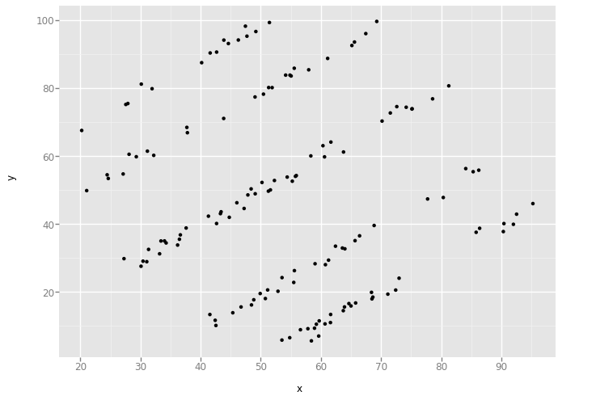


    'star'


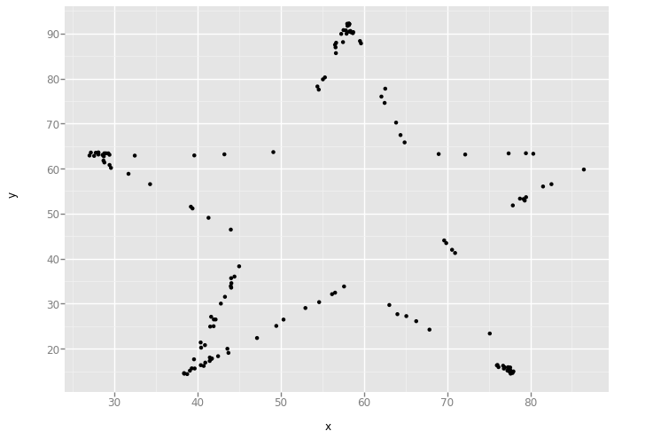


    'v_lines'


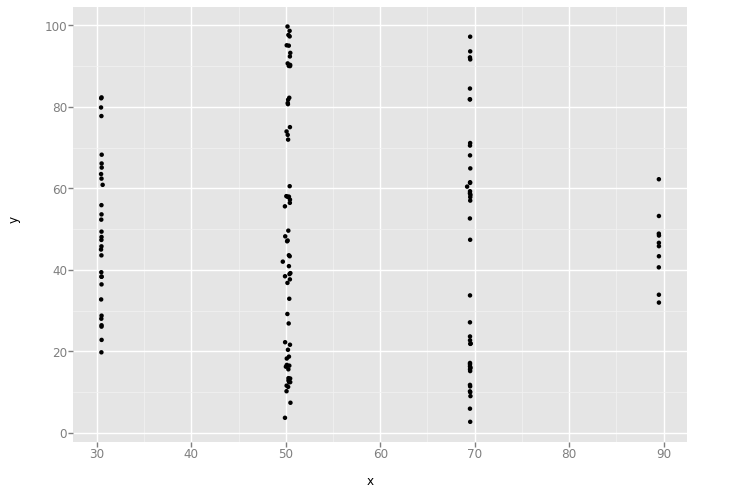


    'wide_lines'


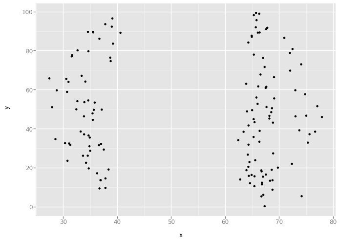


    'x_shape'


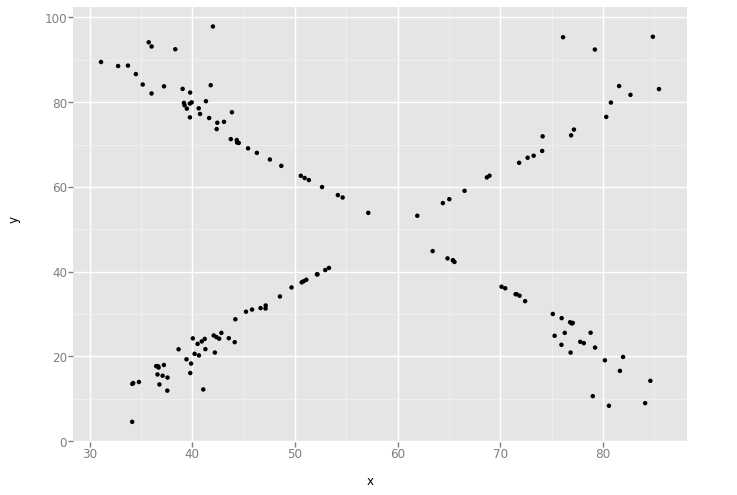


## XY Pairs


```python
for title, frame in data_dict.items():

    length = []
    
    for x0, y0 in zip(frame.x.tolist(), frame.y.tolist()):
        for x1, y1 in zip(frame.x.tolist(), frame.y.tolist()):
            r = hypot(x1-x0, y1-y0)
            length.append(r)
    data = pandas.DataFrame({'length': length})
    plot = ggplot(aes(x='length'), data=data) + geom_histogram(binwidth=1)
    display(title)
    display(plot)

    
```


    'away'


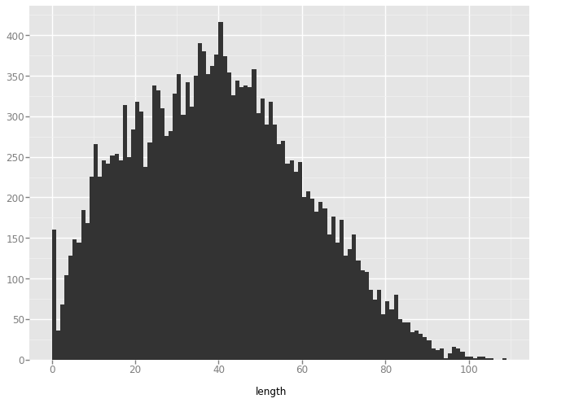


    'bullseye'


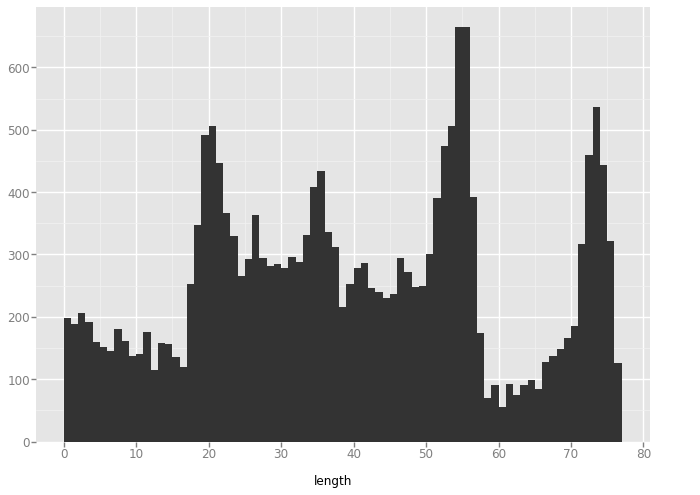


    'circle'


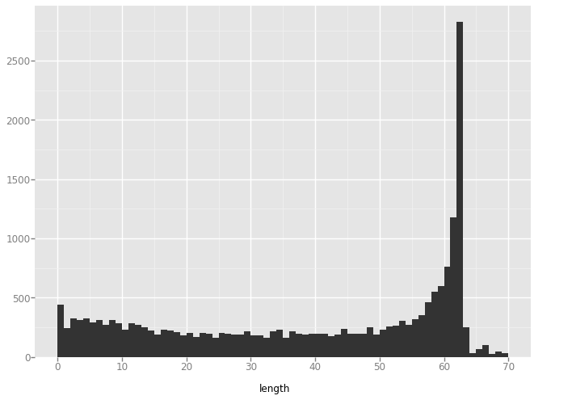


    'dino'


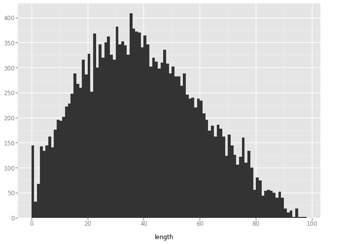


    'dots'


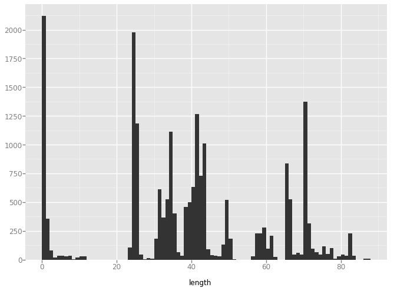


    'h_lines'


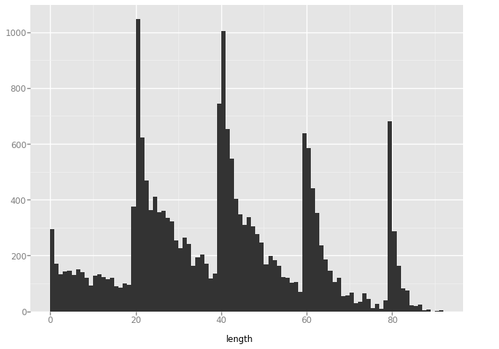


    'high_lines'


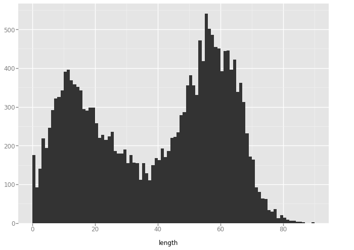


    'slant_down'


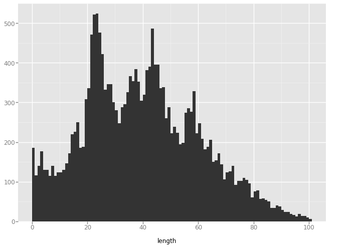


    'slant_up'


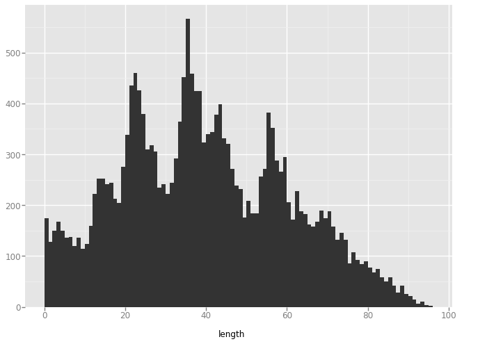


    'star'


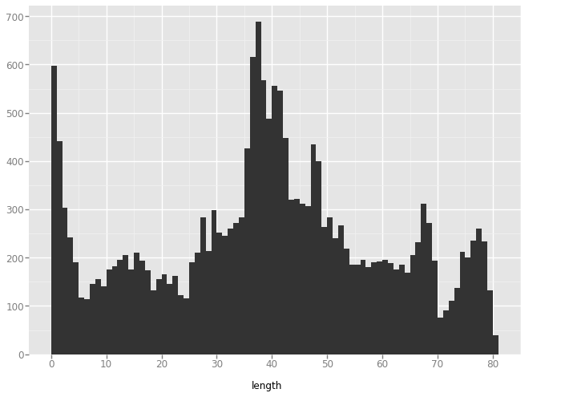


    'v_lines'


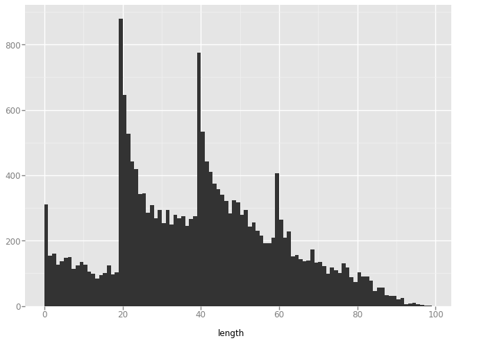


    'wide_lines'


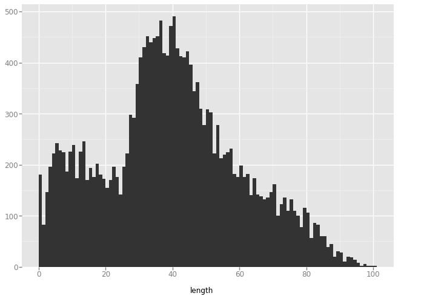


    'x_shape'


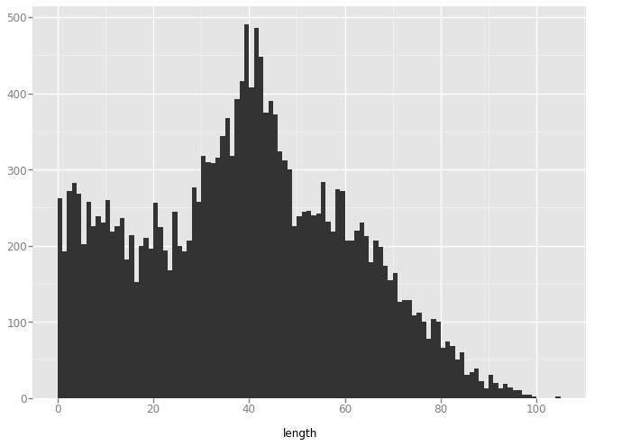


