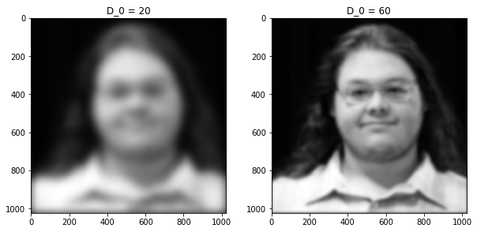

# Image Filtering in the Frequency Domain

```python
# Imports
import numpy as np
from PIL import Image
from matplotlib import pyplot as plt
from IPython.display import display, clear_output
import ipywidgets as widgets
from graphviz import Digraph
```

### Functions from last project


```python
def dft2(image_array, inv=False):
    N, M = image_array.shape
    
    # change the sign for forward/inverse transform
    sign = 1 if inv else -1 
    
    # make the P array as descibed above
    m = np.tile(np.arange(1, N+1), (N, 1))
    n = m.transpose()
    num_array = (m-1)*(n-1)
    phase = np.exp(sign*2j*np.pi/N)**num_array
    
    # matrix multiplication
    result = phase @ (image_array @ phase)
    
    return result/N

# define the inverse in terms of the forward transform
idft2 = lambda x: dft2(x, inv=True)

def center(image_array):
    N, M = image_array.shape
    shift = np.roll(image_array, N//2, axis=0)
    shift = np.roll(shift, N//2, axis=1)
    return shift
```

## Start with an image of yourself

  * Convert image to gray

  * Resize image to 1024 by 1024


```python
original_image = np.array(Image.open('matt.jpg').resize((1024, 1024)).convert('L'), dtype=float)
plt.imshow(original_image, cmap='gray');
```


# Design & apply a Gaussian LPF (GLPF) with $D_0 = 20, ~60$ to smooth your image

#### Design the GLPF transfer function $H(u,v)$ for both $D_0$ values and apply it to your image in the frequency domain.

  * You need to pad and center your image before getting its DFT


```python
def pad(image):
    M, N = image.shape
    new_size = 2*max(M, N)
    padded_image = np.zeros(shape=(new_size, new_size))
    padded_image[0:M, 0:N] = image
    return padded_image

padded_image = pad(original_image)
plt.imshow(pad(original_image), cmap="gray");
```


### Show the filter transfer function for both $D_0$ values

Using $$ \LARGE H_{gauss}[x, y] = e^{-\frac{(x-x_0)^2 + (y-y_0)^2}{D_0^2}}$$


```python
freq_image = center(dft2(padded_image))

def gaussian_filter(size, D):
    
    x = np.arange(0, size, 1, float)
    y = x[:, np.newaxis]
    x0 = y0 = size // 2
    gaussian = np.exp(-((x-x0)**2 + (y-y0)**2) / D**2)
    scaled_gaussian = gaussian/np.amax(gaussian)
    return scaled_gaussian

g20 = gaussian_filter(freq_image.shape[0], 20)
g60 = gaussian_filter(freq_image.shape[0], 60)

fig = plt.figure(figsize=(10, 10))

ax = fig.add_subplot(2, 2, 1)
ax.set_title('D_0 = 20')
plt.imshow(g20, cmap='gray');

ax = fig.add_subplot(2, 2, 2)
ax.set_title('D_0 = 60')
plt.imshow(g60, cmap='gray');
```


### Show the DFT of your image


```python
plt.imshow(np.log(.1+abs(freq_image)), cmap='gray');
```


### Show the transform after you apply the filters


```python
filtered_freq20 = g20*freq_image
filtered_freq60 = g60*freq_image

fig = plt.figure(figsize=(10, 10))

ax = fig.add_subplot(2, 2, 1)
ax.set_title('D_0 = 20')
plt.imshow(np.log(.1+abs(filtered_freq20)), cmap='gray');

ax = fig.add_subplot(2, 2, 2)
ax.set_title('D_0 = 60')
plt.imshow(np.log(.1+abs(filtered_freq60)), cmap='gray');
```


### Show the smoothed images in spatial domain after you take the IDFT for when using both cut off frequencies


```python
fig = plt.figure(figsize=(10, 10))

filtered_image20 = idft2(filtered_freq20)[0:1024, 0:1024]
filtered_image60 = idft2(filtered_freq60)[0:1024, 0:1024]

ax = fig.add_subplot(2, 2, 1)
ax.set_title('D_0 = 20')
plt.imshow(abs(filtered_image20), cmap='gray');

ax = fig.add_subplot(2, 2, 2)
ax.set_title('D_0 = 60')
plt.imshow(abs(filtered_image60), cmap='gray');

```





# Design & apply a Butterworth HPF (BHPF) with $D_0=10; n=2,7$ to sharpen your image

### Show the filter transfer function for both $n$ values

Using $$H_{butterworth} = \frac{1}{1 + \left( \frac{(x-x_0)^2 + (y-y_0)^2}{D^2_0}\right)^n}$$


```python
def butterworth_filter(size, D, n, center=None):
    x = np.arange(0, size, 1, float)
    y = x[:, np.newaxis]
    if center is None:
        x0 = y0 = size // 2
    else:
        x0, y0 = center
    butterworth = 1/(1+( ((x-x0)**2 + (y-y0)**2)/D**2 )**n )
    scaled_butterworth = 1 - butterworth/np.amax(butterworth)
    return scaled_butterworth

b2 = butterworth_filter(freq_image.shape[0], 10, 2)
b7 = butterworth_filter(freq_image.shape[0], 10, 7)

fig = plt.figure(figsize=(10, 10))

ax = fig.add_subplot(2, 2, 1)
ax.set_title('n = 2')
plt.imshow(b2, cmap='gray');

ax = fig.add_subplot(2, 2, 2)
ax.set_title('n = 7')
plt.imshow(b7, cmap='gray');
```


### Show the transform after you apply the filters


```python
filtered_freq2 = b2*freq_image
filtered_freq7 = b7*freq_image

fig = plt.figure(figsize=(10, 10))

ax = fig.add_subplot(2, 2, 1)
ax.set_title('n = 2')
plt.imshow(np.log(.1+abs(filtered_freq2)), cmap='gray');

ax = fig.add_subplot(2, 2, 2)
ax.set_title('n = 7')
plt.imshow(np.log(.1+abs(filtered_freq7)), cmap='gray');
```


### Show the result in spatial domain after you take the IDFT for when using both $n$ values


```python
fig = plt.figure(figsize=(10, 10))

filtered_image2 = idft2(filtered_freq2)[0:1024, 0:1024]
filtered_image7 = idft2(filtered_freq7)[0:1024, 0:1024]

ax = fig.add_subplot(2, 2, 1)
ax.set_title('n = 2')
plt.imshow(abs(filtered_image2), cmap='gray');

ax = fig.add_subplot(2, 2, 2)
ax.set_title('n = 7')
plt.imshow(abs(filtered_image7), cmap='gray');
```


 # Design & apply a Butterworth notch reject filter to remove the moire’ pattern from the image shown below


```python
car_image = np.array(Image.open('car.png').convert('L'), dtype=float)
plt.imshow(car_image, cmap='gray');
```


## You need to pad and center your image before getting its DFT


```python
padded_image_car = pad(car_image)
plt.imshow(pad(car_image), cmap="gray");
```


### Show the DFT of your image


```python
freq_image_car = center(dft2(padded_image_car))
plt.imshow(np.log(.1+abs(freq_image_car)), cmap='gray');
```


### Report the cutoff frequency and the order of the designed filter

Using Butterworth filters of $D_0=25;n=3$

### Show the filter transfer function


```python
size = freq_image_car.shape[0]
D = 25
n = 3
stop_filter = butterworth_filter(size, D, n, (400, 408))* \
              butterworth_filter(size, D, n, (570, 565))* \
              butterworth_filter(size, D, n, (405, 568))* \
              butterworth_filter(size, D, n, (568, 402))* \
              butterworth_filter(size, D, n, (881, 405))* \
              butterworth_filter(size, D, n, (563, 332))* \
              freq_image_car
plt.imshow(np.log(.1+abs(stop_filter)), cmap='gray');

```


### Show the result in spatial domain after you take the IDFT


```python
M, N = car_image.shape
car_fixed = idft2(stop_filter)[0:M, 0:N]
plt.imshow(abs(car_fixed), cmap='gray');
```


