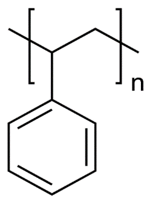
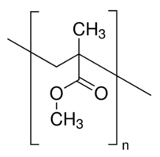
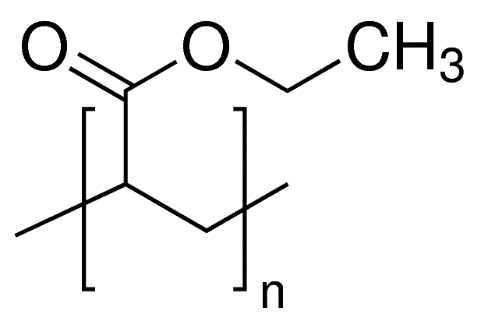

# Analysis of Polymer Opal

## Introduction

Polymer Opal is a synthetic material that is known for having a unique property: the wavelengths of its reflective and transmission spectra are highly sensitive to its strain. This is accomplished by imbedding hard spheres of one polymer in another more elastic polymer with a lower index of refraction, thus making an elastomeric photonic crystal.

## Processing Method

Polymer nanospheres comprised of a core of polystyrene (PS), an inner shell of polymethyl methacrylate (PMMA), and an outer shell of polyethyl acrylate (PEA) are heated, extruded, and rolled into a flat sheet. This process softens the PEA shell into a continuous medium and aligns the spheres into sheets. The layers are sheared on top of each other until the layers are sandwiched into a hexagonal close packed structure. This forms the photonic crystal. [2]

## Chemical and Physical Properties

Polymer Opal is comprised of the following three polymers:

Polystyrene (PS) is a transparent polymer with an index of refraction of 1.59, an elastic modulus of 3.4 GPa, and has a solubility parameter of 18.3 MPa1/2. It has a glass transition of 100 degrees C. [4,11]

Polymethyl methacrylate (PMMA) is transparent with an index of refraction of 1.49, an elastic modulus of 3.1 GPa, and has a solubility parameter of 19.0 MPa1/2. It has a glass transition at 105 degrees C. [5,9,13]

Polyethyl acrylate (PEA) is an acrylic elastomer (ACM) with glass transition at -23 degrees C, which explains why it is a considerably soft and extensible polymer. It is often blended with other acrylic monomers to modify the polymer’s properties to a specific application and so is rarely left as a homopolymer. ACMs are often used vibration damping due to excellent resilience. PEA has an elastic modulus of around 10 MPa, is transparent with an index of refraction of 1.47 and a solubility parameter of 19.1 MPa1/2. [3,6,8,12]

## Synthesis
Most polymers are synthesized using one of four techniques: bulk, solution, suspension, and emulsion polymerization. PS-PMMA-PEA core-shell nanospheres are synthesized using a combination technique of suspension and emulsion polymerization, aptly named suspension-emulsion combined polymerization (SECP). 

First, styrene, a styrene initiator, a suspension agent, and water are added into a reactor. The reactor deoxygenates, agitates, and heats the mixture into a suspension, and suspension polymerization of the styrene takes place, forming PS spheres. Alongside this, a mixture of MMA, MMA initiator, a surfactant agent, and water are sonicated to form an emulsion. This emulsion added to the reactor at a constant rate. The micelles in the emulsion encapsulate the PS spheres, and the MMA undergoes emulsion polymerization around the PS, forming PS-PMMA core-shell nanospheres. Another emulsion step is performed with the ethyl acrylate and ethyl acrylate initiator to form PS-PMMA-PEA core-shell nanospheres. [1]

## Material Suitability and Alternative Materials

It is easy enough to identify that the PS acts as the hard spheres and the PEA acts as the elastic medium, so at this point we ask why the PMMA layer of the nanospheres is necessary.

The PS and PEA have very different properties, with different states (glassy vs rubbery), wildly different elastic moduli (3 GPa vs 10 MPa), and different solubility constants (18 MPa1/2 vs 19 MPa1/2). If these were the only two polymers present, the polymer opal would be very unstable.

The PMMA shell interface makes the inner and outer materials compatible by having the same phase and stiffness as PS and the same solubility parameter and refractive index as the PEA. This allows for the unique optical properties and mechanical properties to coexist in the same medium.

The first place to look for an alternative material is to replace the PS core of the nanospheres with another material, as the solubility doesn’t matter since the stiffness of the PMMA will limit mobility of the cores of the particles. Traditional opal contains spheres of silica, which has a slightly lower index of refraction to the PS at 1.55. Unfortunately, silica is an inorganic material and therefore not a polymer. A polymer of similar processing techniques, thermal properties, and slightly higher refractive index to polystyrene is polyvinylidene chloride (PVDC) at n = 1.62.[7,10]

## Conclusion

The fabrication of polymer opal may be using simple techniques to combine simple materials, but the properties of these materials show that they were specifically chosen to be compatible with each other, and that the combination results in a composite polymer that has unique optical and elastic properties.

## Citations

Journal Articles
1. Zhenqian, Zhang; Yongzhong, Bao; Zhiming, Huang Preparation Of Polystyrene/Poly(Methyl Methacrylate) Core‐Shell Composite Particles By Suspension‐Emulsion Combined Polymerization Journal of Applied Polymer Science, 15 February 2009, Vol.111(4), pp.1659-1669

2. Zhao, Qibin; Finlayson, Chris E; Snoswell, David R E  Large-Scale Ordering Of Nanoparticles Using Viscoelastic Shear Processing Nature communications, 03 June 2016, Vol.7, pp.11661

3. Tong, Xin; Zhao, Haichao; Tang, Tao; Feng, Zhiliu Preparation And Characterization Of Poly(Ethyl Acrylate)/Bentonite Nanocomposites By In Situ Emulsion Polymerization Journal of Polymer Science Part A: Polymer Chemistry, 01 June 2002, Vol.40(11), pp.1706-1711

Web Pages
4. **Polystyrene** Polymer Properties Database
http://polymerdatabase.com/polymers/polystyrene.html

5. **Poly(Methyl Methacrylate)** Polymer Properties Database
http://polymerdatabase.com/polymers/polymethylmethacrylate.html

6. **ACM – Polyacrylic Rubber** Polymer Properties Database
http://polymerdatabase.com/Elastomers/ACM.html

7. **Refractive Index Of Amorphous Polymers** Polymer Properties Database
http://polymerdatabase.com/polymer%20physics/Ref%20Index%20Table%20.html

8. **Poly(Ethyl Acrylate)** Polymer Properties Database
http://polymerdatabase.com/polymers/polyethylacrylate.html

9. **PMMA** Matbase
https://www.matbase.com/material-categories/natural-and-synthetic-polymers/thermoplastics/commodity-polymers/material-properties-of-polymethyl-methacrylate-extruded-acrylic-pmma.html#properties

10. **Refractive Index of SiO2, Fused Silica, Silica, Silicon Dioxide, Thermal Oxide, ThermalOxide**
Filmetrics
https://www.filmetrics.com/refractive-index-database/SiO2/Fused-Silica-Silicon-Dioxide-Thermal-Oxide-ThermalOxide

11. **Polystyrene** Sigma-Aldrich
https://www.sigmaaldrich.com/catalog/product/sial/81401

12. **Poly(Ethyl Acrylate) Solution** Sigma-Aldrich
https://www.sigmaaldrich.com/catalog/product/aldrich/181889

13. **Poly(methyl methacrylate)** Sigma-Aldrich
https://www.sigmaaldrich.com/catalog/substance/polymethylmethacrylate12345901114711

