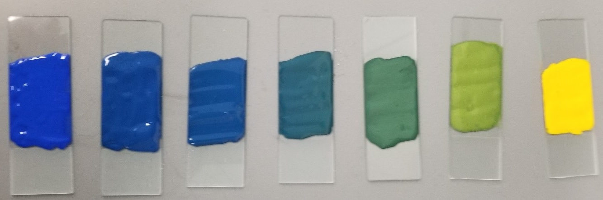
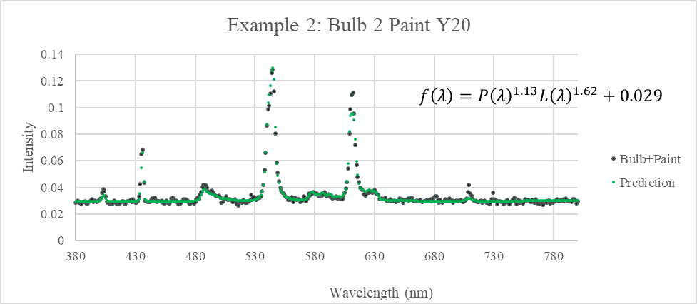

# Analysis of the Spectral Power Distributions of Mixed Paints under Different Light Sources

## Abstract

The purpose of this experiment is to analize how mixing paint samples affects their spectral power distributions under different light sources. Included in this is comparing metamers, two samples with similar appearance in some lighting conditions and different in others.

Using an X-ray Fluorescence (XRF) spectrometer, an Ultraviolet-Visible (UV-Vis) spectrometer, and a Visible Fluorescence spectrometer, various data were collected about these paint samples, and methods of predicting these data were determined.

The outline for this experiment is represented in the form of a flow chart below. Results from this experiment could be further explored in many different and potentially useful ways.

## Sample Background

The samples used in this series of experiments are Apple Barrel® 20513 Bright Yellow, 20596 Cobalt Blue, and 20523 Kelly Green acrylic paints. Because this choice of sample is to represent opaque paint in general, a brief overview of the relevant mechanisms involved with paint will be reviewed.

 
Paint contains four basic components: the binder, the filler, the solvent, and the pigment. The binder makes up the bulk of most paints, and is responsible for the paint’s film-forming capability, gloss, and strength. Most binders are resins that are dissolved or emulsified in the solvent, which most commonly is water or oil. Fillers refer to particles that are added to modify the properties of the polymer, or to decrease the amount of binder required. Finally, pigment is what gives paint its color. Pigments are molecules that absorb select wavelengths of electromagnetic radiation, and otherwise transmit or reflect others.

In colorimetry, color metamerism refers to colors that have entirely different spectral power distributions (SPDs), yet appear to be the same color under some lighting conditions to the human eye. This effect is due to the fact that the human eye (and most cameras) contain only three different types of receptors for perceiving color, of which each are activated to certain levels depending on the intensity and energy of the photons. This collapses an SPD into three values, known as the tristimulus values. Thus, it makes sense that different spectral power distributions can yield the same tristimulus values, and thus appear as the same color. However, the SPD that reaches the eye is not only a function of the pigment contained in the paint, but also the SPD of the light that the paint is exposed to.

Just as with paints, many different “white” lightbulbs emit different SPDs but result in the same tristimulus values. A white incandescent bulb produces a nearly linear SPD, while a mercury vapor lamp produces a handful of sharp peaks in the visible range.

Metamerism is an important concept wherever color matching and visibility is involved. For example, road signs and billboards must be tested under different types of lights to make sure they are legible at night. Manufacturers and repair shops must make sure that the paint used on a replacement or prefab external part matches in all lighting conditions. Interior decorators must make sure that the paint used on different surfaces will match when they are supposed to.

## Experimental Background

This experiment uses four different instruments, all of which are some sort of spectrometer, an instrument that measures energies and intensities of electromagnetic radiation.

### XRF

The first instrument used is the X-ray Fluorescence (XRF) spectrometer, which uses the fluorescence of X-rays from a sample to determine the composition of different elements. This works by exciting inner-orbital electrons in atoms in the sample with an X-ray beam. This causes those electrons to be ejected, and other electrons in the atom to jump down to occupy the hole. This jumping down generates x-rays of energy characteristic of the atoms present in the sample. The emission spectrum can be used to infer the composition of atoms in the sample. The XRF used in this experiment is an instrument in the Rigaku NEX line of X-ray Fluorescence (XRF) spectrometers.

### UV-Vis

Next is the Ultraviolet-Visible (UV-Vis) spectrometer in reflectance mode, which uses monochromatic beam that sweeps through the visible and ultraviolet electromagnetic range, and reflects the beam off of the sample into a monochromatic detector. Note that unlike the other instruments used in this experiment, where the radiation emitted from the sample is filtered, the UV-Vis filters the energy of the incident beam instead. The UV-Vis used in this experiment is the Cary 5000 UV-Vis-NIR spectrometer.
 
### Digital Camera

The digital camera is included in the instrumentation for this report because it is used as an instrument that can determine approximate tristimulus values for the paint samples. The camera works by covering a two-dimensional array of photosensors, most commonly covered in a Bayer color filter. This color filter covers each photosensor with either red, green, or blue film that only allows that band of wavelengths through. These films approximate the response of the three cones in the human eye. The camera used in this experiment is the camera included in the Samsung Note-8 smartphone.

### PASCO Spectrometer

The PASCO PS-2600 Spectrometer was used to capture the SPDs of the light sources and the light emitted by the paint samples irradiated by those light sources. This spectrometer acts similarly to the digital camera, measuring fluorescence, but does so by using a fiber optic cable that carries the visible light into a prism, instead of a lens and colored film, that refracts the light onto an array of photodetectors.

### Other Instruments and Tools

Additional to the instruments listed above, a standard gram scale was used to pre-weigh the amount of paint in each paint mixture. Microsoft Excel and the Python programming language were used for data processing, and each instrument used it’s own data capture program.

## Experimental Results

### Determination of Pigment Composition

The first instrument used after the paints were mixed and died was the Rigaku NEX XRF, which gives element composition data. Because the composition of each paint was not known, the raw spectral data were used for analysis as opposed to the elemental report generated by the included software with the Rigaku XRF instrument. The power distribution from the low-Z scan performed by the XRF shows a significant difference in intensity for some of the peaks.

Selecting the peak with the widest intensity difference (here, between 2 keV and 2.5keV), the relative composition of yellow paint in each sample can be found. 

The tie line formula, $Y_x=\frac{x-B}{Y-B}$, results in a better measurement of relative composition of yellow paint in each mixture.

Wet Composition | 100%  | 90%   |  52%  | 29%   | 28%  | 7%   | 0%
----------------|-------|-------|-------|-------|------|------|------
Intensity       | 0.16  | 0.79  | 1.57  | 2.08  | 2.38 | 2.44 |	2.57
Dry Composition	|100.0% | 73.9% | 41.5% | 20.3%	| 7.9% | 5.4% |	0.0%

  
The change in composition is probably due to many factors, including the paint not being mixed perfectly evenly, lost paint from the stirring sticks, and most importantly, different compositions of solvent lost from the wet paints. As the paints dries, the ratio of one paint in another changes depending on the mass fraction of the solvent in each sample. Samples that were more dilute would have their relative composition in the mixture decrease as the paint dried, as more mass has been lost from that ingredient. 
 
### Paint Mixture Spectral Power Distributions

The next instrument used was the Cary 5000 UV-Vis-NIR to obtain the visual spectral power distribution (VSPD) of each of the samples. The purpose of this step is twofold: to establish a baseline SPD for each paint sample, and to determine a function that could predict the SPD of a paint mixture just from the SPDs of its component paints.

Here the Y0 SPD peaks in the 450-nm range, and the yellow has a broad peak from 500 to 800 nm, which is as expected. Note that the these SPDs have a fixed reflectance point at 500nm, hinting that if two paint SPDs intersect at a point, all mixtures of those paints will also intersect that point. More paint samples will have to be tested to explore this further. Sample G (non-mixture green) does not have much reflectance in the longer wavelengths, which may contribute to metamerism later in the experiment.

An attempt was made to determine a function that would predict the SPD of a mixture from the SPDs of the unmixed paints. The closest fit found was a weighted product model, which fits within the two curves, but does not match any specific SPD. Given that the fitting function only contains only one degree of freedom, the fit is most likely not a case of overfitting, but different paint samples should be tested to determine the robustness of this fit.

### Paints Irradiated by Various Light Sources

#### Metamerism Determination via Digital Camera

A picture of all paint samples under each lighting condition was taken, and the RGB values (red intensity, green intensity, blue intensity) of each paint sample were extracted. The average and standard deviation of the intensity differences of Y90-Y52 and Y90-G across the red, green, and blue channels were computed, and the Euclidean norm of each results in the color distance and color metamerism. Thus, a crude metamerism function is obtained, but such a function requires each mixture to be made and set under each type of light, which defeats the purpose of a general-purpose metamerism function.

 
#### Metamerism Determination via Spectrometry

The other approach, the one that is being developed in this report, is to determine a metamerism function based only on the SPDs of the original paints and light sources, so that the metamerism code can be computed without physically arranging and mixing the samples. 

The emission SPDs of each paint sample under each bulb type were recorded using the PASCO spectrometer. A prediction function type was determined that takes the SPDs of the alone bulb and the alone paint, and combined them into a SPD that matches what is emitted by that paint sample under that light. The functions are in the form of $f\left(\lambda\right)=P\left(\lambda\right)^aL\left(\lambda\right)^b+c$, where λ is the wavelength, P(λ) is the SPD of the paint, L(λ) is the SPD of the light bulb, a and b are system dependent constant exponents, usually between 1 and 3, and c is another system-dependent constant that vertically shifts the SPD.

## Discussion and Conclusion

The next step for continuing this experiment would be to convert the various SPDs generated into tristimulus values, as that was part of the original plan for this experiment. The most likely approach would be to use the International Commission on Illumination’s 1931 RGB color matching functions, which multiplies the SPDs with a red, green, and blue observer function, and integrates over each to yield tristimulus values. This would give a way of predicting metamerism.

Another way continuation of this experiment could be performed is to try more paint samples of different colors, not just limited to greens. Pink and Magenta colors in particular would be interesting, because no one wavelength can represent those colors, as they need to excite the red and blue cones, but not the green cones, in the eye. Therefore, there will likely be more variation in the SPDs of magentas than of greens.

What has been determined, however, is that much of how mixtures of paints and lights have a weighted product nature, which are functions that are easily computed and are easily reversible as well.

