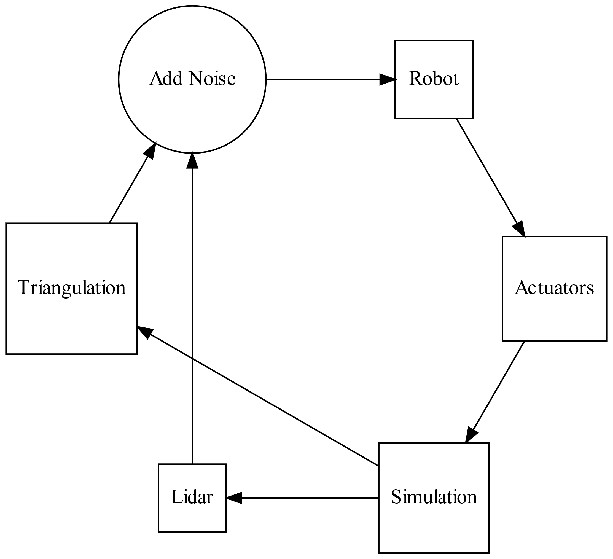
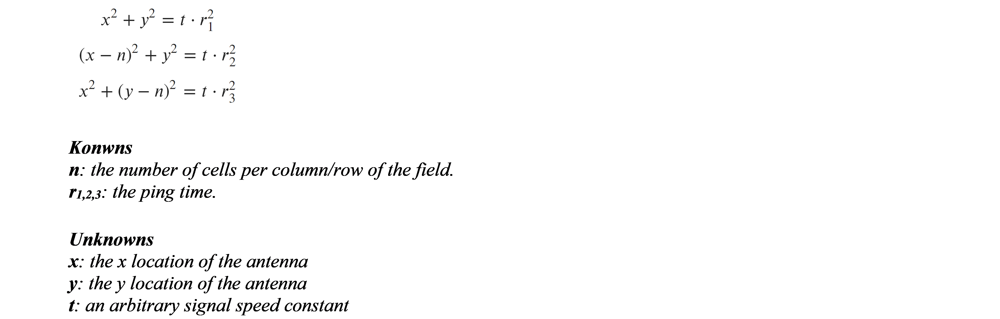
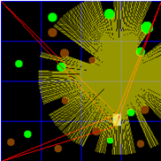
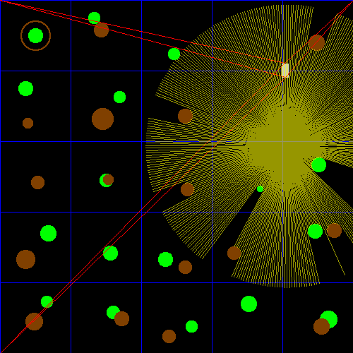

# Autonomous Field Plant Detection using Grid-Based Algorithms 

**Abstract**—This paper demonstrates a possible solution to detecting plants in a field via a simulation.

## 1. Introduction
The objective of this project is to verify the feasibility of developing an autonomous robot that can identify plants in a field. Simple localization, path-planning, and identification algorithms prove to be sufficient in identifying the plants, and can act as a base-line for more advanced algorithms and techniques that could be implemented in actual hardware.

This verification was performed by simulating a crop of plants, a robot, sensors, and actuators all in one Python script. The sensors and actuators act as an interface layer, simulating realistic values that real sensors and actuators may relay to or from the robot, so that the automation algorithms used by the robot cannot access simulation parameters directly.

The simulation demonstrates that Lidar and local positioning sensors, and a grid-based path-planning algorithm are all that is necessary to map nearly all the plants in the field given specific conditions. The only scenario that this approach cannot account for is if there are obstacles covering a plant from all viewing angles, and therefore undetectable by Lidar.

## 2. Background
Robotics has many applications in agricultural engineering. [1, 2] By identifying the number and location of plants in a field, farmers can gather insight about factors that influence the potential yield of the crop. This process is time-consuming and not cost-effective if done manually, so the application of autonomous robotics is worthwhile area of research. This problem would involve having the robot drive through the field, mapping the locations of both the plants and the robot itself. 

This area of research is known as SLAM, or simultaneous localization and mapping. This is a very complex problem, usually involving many non-deterministic, probability-based algorithms, involving fusing data from sensors and knowledge about the environment for object detection and path-planning. Because this is such a complicated problem, any simplifications that could be made would make the plant-detection problem more tractable. These are the simplifications used to reduce the complexity for the purposes of this paper:

1. Crops are planted on a grid of regular square cells, of which there are no obstacles on the cell lines.

2. The plants are green, while obstacles are not.

3. There is at most one plant per grid cell.

4. Plants do not move.

With these simplifications, all the robot would need to have is some method of terrestrial movement, knowledge of the grid-spacing of the crop, a sensor capable of detecting the distance and color of near-by objects, and a localization sensor. The rest of this paper describes the specific implementation of these in simulation as a proof-of concept.

## 3. Experimental
The simulation is entirely written in one Python (version 3.6) script, displayed as a Jupyter notebook, using the standard libraries, as well as the following packages:
 
1. **Numpy**
The Numpy package allows for faster numerical calculations, such as angle, distance, and noise. [a]

2.	**Sympy**
The Sympy package is a symbolic math library, which is used in generating solutions for the triangulation algorithm described in the next section. [b]

3.	**PIL**
PIL is a graphics library, which is used to draw the simulation. [c]

4.	**IPython**
IPython is a python library and environment that allows the PIL graphics to be displayed in-line with the script code. [d]

This simulation should be hardware-agnostic, so the hardware used to run the simulation will not be listed.

## 4. Technical Approach

### 4.1	Functional Block Diagram



The simulation was written in such a way that the part of it that runs the robot is not able to access elements of the simulation directly, but only through the simulated Lidar and Triangulation sensors, which give more realistic information to the robot, including adding noise to the sensor data. 

The robot then processes these data and uses them to update internal models about its own location and the location of the plants. Based off these updated models, the robot sends information to the simulated actuators, which move the robot in the simulation.

### 4.2	Algorithms

1. Navigation and Search Generate a path based off of the shape of the grid. This path visits every internal grid point in a column before moving to the closest grid point in the next column.

    1. Relocate. If the robot is within a theshold angle facing the next grid point, go to step c. Otherwise go to step b.
  
    2. Tell the actuators to turn the robot clockwise an arbirtaty amount. Go to step a.

    3. Relocate. If the robot is within a treshold  distance to the next point, go to Step e. Otherwise go to step d.

    4. Tell the acuators to move the robot forward an arbitrary amount. Go to step c.
    
    5. Scan. If there are more via points, pick the next and go to step a. Otherwise terminate the program.

2.	Relocate (Triangulation). Setup three signal relays in the corners of the field.
    1.	Using the back antenna, ping the signal relays. Record the time it takes for each of the relays to pong back to the antenna. 
    2. Using these times, to get the x,y locations of the back antenna relative to the grid (the time constant is not needed), solve the system of equations:
    
    
    
    3. Repeat steps a and b for the front antenna.

    4. Using the x,y locations of anennas, calculate the angle of the robot relative to the grid. Update the internal model of the robot with the back x,y and angle values.

3. Scan (Lidar)
    1.	Shoot a laser to the nearest object. 
    2.	If there is an object, record the angle of the laser, and object’s distance and color. If the object is green, use the robot’s location and angle, the laser distance and angle to solve for the cell and location of the plant. If there is no plant in that cell in the log, record it as a new plant. If there is a plant in that cell, update it’s location in the log.
    3. Repeat steps a-c until the laser has made one full rotation.

## 5. Results and Analysis
The above algorithms were in imbedded on a robot in a virtual environment, where sensors had noise added to simulate real sensors. The robot can identify all plants and their locations to within one diameter away from its true location.



### 5.1 Failure Cases
The robot is unable to identify a plant is if it is obstructed on all sides, as the lidar would never have line-of-sight to the object. 

The triangulation algorithm sometimes does not converge on a solution or gives more than one. In the first case, the robot is instructed to keep doing what is was doing before, and in the second case, the nearest location to the previous predicted location is taken. The algorithm is also slow, having to resolve the system of equations every time the robot moves. In simulation it is the limiting factor of the speed of the program, but this will likely not be the case for a real robot.

If the thresholds for reaching the via-points are too large, the robot will miss the neighborhood of the via-point and will continue forward indefinitely. However, smaller thresholds mean that the robot must relocate itself more often.


## 6. Future Work
As discussed in the introduction, many simplifications were made. Future work on this project would be to remove these simplifications to see if the algorithms would still work. Additionally, these algorithms were verified by simulation only, so the obvious next step would be to verify the simulation on actual hardware.

The algorithms used could also be improved, as the robot only turns in one direction, and the triangulation algorithm could be made faster by vectorization or by caching the general solution of the system of equations. The Lidar detection algorithm identifies everything green as a plant, which may not be the case, so more sophisticated object recognition algorithms could improve identification and plant location accuracy. [3]

## 7. Conclusion
This project has demonstrated successful use of Autonomous Field Plant Detection using Grid-Based Algorithms.

## 8. Acknowledgements

 * Dr. Balasubramaniyan Chandrasekaran for assigning this project.

 * John Goldsmith for general advice regarding the project.

## References
1.	Attribution References

    1. http://www.numpy.org/
    2. https://www.sympy.org
    3. https://pillow.readthedocs.io/
    4. https://ipython.org/


2.	Research References

    1. A. Korsaeth, E. Houssein, C. Harik, “Combining Hector SLAM and Artificial Potential Field for Autonomous Navigation Inside a Greenhouse,” Robotics, Vol 7, Iss 2, p 22 (2018).

    2. Yamamoto, I. (2016). Practical robotics and mechatronics. Stevenage, Herts.: Institution of Engineering and Technology.

    3. D. Morris, “Obstacles and foliage discrimination using lidar”, Proceedings of SPIE; May 2016, Vol. 9837 Issue: 1 p98370E-98370E-12, 9738643p.


## Appendix A: Code


```python
import numpy as np
import sympy as sp
from PIL import Image, ImageDraw
from IPython.display import display, clear_output
import math

from time import sleep
```

### Grid Class

Contains where the plants and obstacles actually are.


```python
class Grid:
    
    def __init__(self):
        self.divisions = 5
        self.size = 500
        self.cell_size = self.size/self.divisions
        
        self.robot_x = 50
        self.robot_y = 50
        self.robot_angle = np.pi/4
        self.robot_length = 20
        
        self.draw_gridlines()
        self.draw_plants()
        self.draw_obstacles()
        self.draw_robot()
        self.draw_triangulation()
        self.draw_scan()
    
    
    def draw_gridlines(self):
        
        self.gridlines_layer = Image.new("RGBA", (self.size, self.size))
        draw = ImageDraw.Draw(self.gridlines_layer)
        
        
        for i in range(self.divisions):
            for j in range(self.divisions):
                x0 = int(round(self.cell_size*i))
                y0 = int(round(self.cell_size*j))
                x1 = int(round(self.cell_size*(i+1)))
                y1 = int(round(self.cell_size*(j+1)))
                draw.rectangle((x0, y0, x1, y1), outline=(0, 0, 255))        

    
    def draw_plants(self):
                         
        self.plants_layer = Image.new("RGBA", (self.size, self.size))
        draw = ImageDraw.Draw(self.plants_layer)
        
        for i in range(self.divisions):
            for j in range(self.divisions):
                
                x0 = int(round(self.cell_size*i))
                y0 = int(round(self.cell_size*j))
                
                if (i, j) == (0, 0):
                    plant_size = self.cell_size/10
                    plant_center_x, plant_center_y = (int(x0 + self.cell_size/2), 
                                                      int(y0 + self.cell_size/2))

                    draw.ellipse((plant_center_x - plant_size, 
                                  plant_center_y - plant_size,
                                  plant_center_x + plant_size,
                                  plant_center_y + plant_size),
                                  fill=(0, 255, 0))
                    continue

                is_plant = np.random.randint(0, 3)
                
                if is_plant:
                    plant_size = int(np.random.normal(self.cell_size/10, self.cell_size/50))
                    plant_center_x, plant_center_y = (x0 + np.random.randint(self.cell_size/5, 4*self.cell_size/5), 
                                                      y0 + np.random.randint(self.cell_size/5, 4*self.cell_size/5))

                    draw.ellipse((plant_center_x - plant_size, 
                                  plant_center_y - plant_size,
                                  plant_center_x + plant_size,
                                  plant_center_y + plant_size),
                                  fill=(0, 255, 0))    
 
    
    def draw_obstacles(self):
                         
        self.obstacles_layer = Image.new("RGBA", (self.size, self.size))
        draw = ImageDraw.Draw(self.obstacles_layer)
        
        for i in range(self.divisions):
            for j in range(self.divisions):
                x0 = int(round(self.cell_size*i))
                y0 = int(round(self.cell_size*j))
                
                if (i, j) == (0, 0):
                    obstacle_size = self.cell_size/5
                    obstacle_center_x, obstacle_center_y = (int(x0 + self.cell_size/2), 
                                                            int(y0 + self.cell_size/2))

                    draw.ellipse((obstacle_center_x - obstacle_size, 
                                  obstacle_center_y - obstacle_size,
                                  obstacle_center_x + obstacle_size,
                                  obstacle_center_y + obstacle_size),
                                  outline=(128, 64, 0))
                    
                    draw.ellipse((obstacle_center_x - obstacle_size - 1, 
                                  obstacle_center_y - obstacle_size - 1,
                                  obstacle_center_x + obstacle_size + 1,
                                  obstacle_center_y + obstacle_size + 1),
                                  outline=(128, 64, 0))
                    continue
                
                is_obstacle = np.random.randint(0, 3)
                
                if is_obstacle:
                    obstacle_size = int(np.random.normal(self.cell_size/10, self.cell_size/50))
                    obstacle_center_x, obstacle_center_y = (x0 + np.random.randint(self.cell_size/5, 4*self.cell_size/5), 
                                                            y0 + np.random.randint(self.cell_size/5, 4*self.cell_size/5))

                    draw.ellipse((obstacle_center_x - obstacle_size, 
                                  obstacle_center_y - obstacle_size,
                                  obstacle_center_x + obstacle_size,
                                  obstacle_center_y + obstacle_size),
                                  fill=(128, 64, 0))
        
    
    
    
    def draw_triangulation(self):
        
        self.triangulation_layer = Image.new("RGBA", (self.size, self.size))
        draw = ImageDraw.Draw(self.triangulation_layer)
        
        base_x = self.robot_x
        base_y = self.robot_y
        head_x = base_x + self.robot_length*np.cos(self.robot_angle)
        head_y = base_y + self.robot_length*np.sin(self.robot_angle)
        width  = self.size
        
        t1_base = np.hypot(base_x - 0, base_y - 0)
        t2_base = np.hypot(width - base_x, base_y - 0)
        t3_base = np.hypot(base_x - 0, width - base_y)
        t1_head = np.hypot(head_x - 0, head_y - 0)
        t2_head = np.hypot(width - head_x, head_y - 0)
        t3_head = np.hypot(head_x - 0, width - head_y)
        
        draw.line((0, 0, base_x, base_y),     fill=(255, 0, 0))
        draw.line((width, 0, base_x, base_y), fill=(255, 0, 0))
        draw.line((0, width, base_x, base_y), fill=(255, 0, 0))
        draw.line((0, 0, head_x, head_y),     fill=(255, 0, 0))
        draw.line((width, 0, head_x, head_y), fill=(255, 0, 0))
        draw.line((0, width, head_x, head_y), fill=(255, 0, 0))
                         
        return (t1_base, t2_base, t3_base, t1_head, t2_head, t3_head)
    
    
    def draw_robot(self):
        self.robot_layer = Image.new("RGBA", (self.size, self.size))
        draw = ImageDraw.Draw(self.robot_layer)
        
        base_x = int(self.robot_x)
        base_y = int(self.robot_y)
        head_x = base_x + int(self.robot_length*np.cos(self.robot_angle))
        head_y = base_y + int(self.robot_length*np.sin(self.robot_angle))
        
        draw.line((base_x, base_y, head_x, head_y), fill=(200, 200, 200), width=10)
    
    
    def draw_scan(self):
        self.scan_layer = Image.new("RGBA", (self.size, self.size))
        draw = ImageDraw.Draw(self.scan_layer)
        
        collision_map = Image.new("RGB", (self.size, self.size))
        collision_map.paste(self.plants_layer, (0,0), self.plants_layer)
        collision_map.paste(self.obstacles_layer, (0,0), self.obstacles_layer)
        
        steps = 360
        scan_data = []
        cell_distance = 2
        max_angle = 2*np.pi
        for angle in np.linspace(0, max_angle, steps):
            ray_len = 0
            ray_x = int(self.robot_x)
            ray_y = int(self.robot_y)
            true_angle = self.robot_angle + angle
            while 0 <= ray_x < self.size and 0 <= ray_y < self.size and ray_len < self.cell_size*cell_distance:
                color = collision_map.getpixel((int(ray_x), int(ray_y)))
                if color != (0, 0, 0):
                    scan_data.append((angle, ray_len, color))
                    break
                ray_len += 1
                ray_x = np.cos(true_angle)*ray_len + self.robot_x
                ray_y = np.sin(true_angle)*ray_len + self.robot_y
            start = (int(self.robot_x), int(self.robot_y))
            stop  = (int(ray_x), int(ray_y))
            draw.line((start, stop), fill=(255, 255, 0, 150))
                    
        return scan_data
            
    
    def update(self):
        self.simulation_layer = Image.new("RGB", (self.size, self.size))
        for layer in (self.gridlines_layer, 
                      self.plants_layer, 
                      self.obstacles_layer, 
                      self.robot_layer,
                      self.triangulation_layer,
                      self.scan_layer):
            self.simulation_layer.paste(layer, (0,0), layer)
        
    
    def show(self):
        clear_output(wait=True)
        display(self.simulation_layer)
        
        
grid = Grid()

```

### Actuators

**DONE**

#### Move

Moves the robot forward an arbitrary amount

#### Turn

Rotates the robot an arbitrary amount


```python
class Actuators():
    
    def move(self, pos=True):
        amount = 2 if pos else -2
        grid.robot_x += amount*np.cos(grid.robot_angle)
        grid.robot_y += amount*np.sin(grid.robot_angle)
        grid.draw_robot()
        grid.update()
        
    def turn(self, pos=True):
        amount = 0.1 if pos else -0.1
        grid.robot_angle = grid.robot_angle + amount
        grid.draw_robot()
        grid.update()
        
actuators = Actuators()
```

### Sensors Class

Reads from Grid Class.

Writes to Robot class.

#### Ping

**Input**: None

**Output**: (t1_base, t2_base, t3_base, t1_head, t2_head, t3_head)

Simulated travel time of a ping between the base antenna with the three poles, and the head antenna with the three poles.

Distances are modified by an arbitraty constant speed and variable noise

#### Scan

**Input**: None

**Output**: List of (relative_angle, distance, color)


```python
class Sensors:
        
    def ping(self):
        '''
        Simulates the robot pinging three of the corners of the map
        Returns the travel time of the ping to the base and the head
        Distances are modified by an arbitraty constant speed and variable noise
        '''
        speed = 0.56
        noise = lambda: np.random.normal(0, 0.01)
        times = grid.draw_triangulation()
        times = [noise() + t/speed for t in times]
        grid.update()
        return times
    
    def scan(self):
        noise = lambda: np.random.normal(0, 0.01)
        scan_data = grid.draw_scan()
        scan_data = [(angle, distance + noise(), color) for (angle, distance, color) in scan_data]
        grid.update()
        return scan_data

    
sensors = Sensors()
```

### Robot Class

Contains actual algorithms that would be able to run on a real robot.

Reads from Sensors Class.

Writes to Actuators Class.


```python
class Robot():
    
    
    def __init__(self, size, divisions):
        self.grid_size = size
        self.divisions = divisions
        self.cell_size = size/divisions
        
        self.found_plants = {}
        self.via_points = self.via_point_gen()
        #self.find_plants()
        
        
    def triangulate(self, r1, r2, r3):

        x, y, t = sp.symbols('x, y, t', positive=True)
        n = self.grid_size

        eq1 =     x**2 +     y**2 - t*r1**2 # Top Left
        eq2 = (x-n)**2 +     y**2 - t*r2**2 # Top Right
        eq3 =     x**2 + (y-n)**2 - t*r3**2 # Bottom Right

        system = [eq1, eq2, eq3]
        try:
            solution = sp.solve(system, [x, y, t])[0]
        except:
            solution = None
        return solution
    
    def via_point_gen(self):
        grid_range = range(1, self.divisions)
        for x in grid_range:
            y_range = grid_range if x%2 else reversed(grid_range)
            for y in y_range:
                yield (x, y)
    
    
        
    def relocate(self):
        ping_data = sensors.ping()
        base, head = ping_data[:3], ping_data[3:]
        try:
            base_x, base_y, _ = self.triangulate(*base)
            head_x, head_y, _ = self.triangulate(*head)
            angle = math.atan2(head_y - base_y, head_x - base_x)

            self.x, self.y, self.angle = base_x, base_y, angle
        except KeyboardInterrupt:
            raise
        except:
            pass
        
    def scan(self):
        scan_data = sensors.scan()
        
        for (relative_angle, distance, (r, g, b)) in scan_data:
            
            true_angle = self.angle + relative_angle
            object_x = np.cos(true_angle)*distance + self.x
            object_y = np.sin(true_angle)*distance + self.y
            
            if g == 255: # The lidar hit a plant
                obj_cell_x = object_x/self.cell_size
                obj_cell_y = object_y/self.cell_size
                self.found_plants[(int(obj_cell_x), int(obj_cell_y))] = (obj_cell_x, obj_cell_y)
                
                
    
    
    def move_to_next_point(self):
        
        angle_threshold = 0.1
        dist_threshold = 12
        
        self.relocate()
        target_x, target_y = next(self.via_points)
        target_x, target_y = target_x*self.cell_size, target_y*self.cell_size
        
        # Turn to next point
        relative_angle = math.atan2(target_y - self.y, target_x - self.x)
        
        offset_angle = self.angle - relative_angle
        offset_angle = math.atan2(math.sin(offset_angle), math.cos(offset_angle))
        
        while abs(offset_angle) > angle_threshold:
            #print(target_x, target_y)
            #print(relative_angle*180/np.pi + 360)
            #print(offset_angle)
            actuators.turn(pos=True)
            relative_angle = math.atan2(target_y - self.y, target_x - self.x)
            offset_angle = self.angle - relative_angle
            offset_angle = math.atan2(math.sin(offset_angle), math.cos(offset_angle))
            self.relocate()
            grid.show()
            
        offset_dist = math.hypot(target_y - self.y, target_x - self.x)
        
        while offset_dist > dist_threshold:
            #print(target_x, target_y)
            #print(offset_dist)
            actuators.move(pos=True)
            offset_dist = math.hypot(target_y - self.y, target_x - self.x)
            self.relocate()
            grid.show()
            
    def find_plants(self):
        for step in range((self.divisions-1)**2):
            self.move_to_next_point()
            self.scan()
            print(self.found_plants)
    
robot = Robot(size=grid.size, divisions=grid.divisions)
```

### Testing


```python
robot.find_plants()
```





    {(1, 2): (1.58372367317055, 2.60943428413511), (0, 1): (0.397641419292541, 1.15873233654167), (1, 0): (1.33319325759840, 0.339863361246582), (2, 0): (2.52274200245479, 0.703522455059258), (1, 1): (1.76639360622533, 1.33218088973322), (0, 3): (0.671530610564317, 3.18995978084844), (1, 3): (1.59353067052239, 3.48247105882204), (0, 4): (0.631718089273461, 4.19169362426626), (2, 3): (2.31972910722124, 3.56957609765018), (1, 4): (1.57899792233301, 4.33326116425413), (2, 4): (2.64238393521103, 4.57739898576207), (1, 5): (1.57338116415573, 5.55116978243173), (2, 2): (2.83248270397766, 2.96278851056891), (3, 3): (3.33050020047804, 3.80414822433146), (3, 2): (3.65610588460032, 2.64339048817441), (3, 4): (3.45929898271956, 4.21828495335808), (4, 2): (4.41184626932278, 2.36928904139090), (4, 3): (4.36381641517094, 3.24440714919907), (4, 4): (4.54176593248722, 4.46149814539187)}
    


```python

```
