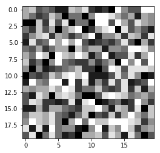

# This is a test

I want to see if I can get a jupyter notebook to be hosted on my github pages site


```python
code = 'hello world'
code = code.replace('hello', 'what\'s up')
code
```


    "what's up world"


```python
import numpy as np
pic = np.random.randint(low=0, high=10, size=(20, 20))
pic
```


    array([[6, 7, 3, 4, 3, 1, 1, 7, 6, 8, 2, 1, 2, 0, 9, 5, 3, 3, 9, 9],
           [6, 4, 2, 3, 7, 5, 0, 4, 4, 0, 5, 9, 9, 8, 6, 4, 6, 1, 6, 5],
           [0, 0, 7, 2, 8, 3, 8, 0, 4, 4, 0, 9, 9, 3, 9, 6, 3, 8, 6, 5],
           [4, 2, 7, 3, 6, 0, 5, 7, 9, 0, 2, 6, 8, 9, 0, 8, 3, 5, 3, 1],
           [2, 5, 7, 8, 2, 6, 5, 2, 4, 6, 9, 1, 5, 5, 7, 2, 7, 6, 2, 8],
           [1, 8, 3, 4, 9, 6, 9, 6, 9, 3, 1, 2, 3, 2, 4, 8, 3, 0, 6, 2],
           [4, 3, 6, 2, 4, 6, 6, 0, 7, 4, 6, 6, 1, 5, 5, 4, 9, 9, 8, 5],
           [6, 4, 9, 7, 0, 9, 7, 6, 9, 7, 1, 4, 9, 1, 3, 3, 8, 2, 6, 9],
           [7, 2, 4, 0, 5, 9, 4, 3, 2, 2, 5, 2, 4, 6, 0, 9, 5, 9, 3, 9],
           [5, 0, 5, 1, 2, 3, 4, 5, 7, 2, 2, 0, 3, 9, 8, 3, 8, 8, 8, 7],
           [0, 3, 2, 3, 7, 5, 8, 9, 7, 9, 1, 1, 1, 3, 8, 4, 8, 5, 0, 1],
           [1, 9, 5, 4, 9, 9, 1, 9, 2, 8, 1, 5, 2, 8, 3, 8, 1, 2, 3, 9],
           [6, 5, 6, 6, 8, 6, 9, 8, 2, 4, 4, 7, 3, 2, 3, 8, 2, 7, 1, 6],
           [3, 1, 8, 6, 0, 7, 8, 7, 4, 0, 0, 3, 8, 9, 8, 7, 4, 5, 6, 4],
           [3, 8, 7, 2, 2, 1, 2, 8, 1, 8, 9, 0, 1, 3, 4, 1, 2, 9, 5, 2],
           [1, 1, 6, 2, 6, 6, 4, 3, 2, 7, 7, 9, 5, 1, 7, 6, 2, 8, 0, 7],
           [4, 7, 7, 6, 8, 4, 3, 1, 4, 7, 0, 3, 2, 7, 2, 6, 9, 6, 4, 7],
           [5, 9, 7, 6, 8, 4, 0, 6, 9, 4, 9, 7, 7, 9, 9, 9, 8, 7, 2, 5],
           [8, 1, 8, 1, 9, 4, 5, 5, 1, 0, 5, 9, 1, 7, 5, 9, 7, 2, 5, 6],
           [3, 8, 0, 4, 8, 4, 1, 2, 0, 6, 6, 7, 3, 8, 6, 1, 8, 4, 0, 3]])


```python
from matplotlib import pyplot as plt
plt.imshow(pic, cmap='gray');
```





$ \LARGE x = \frac{-b \pm \sqrt{b^2 - 4ac}}{2a}$
